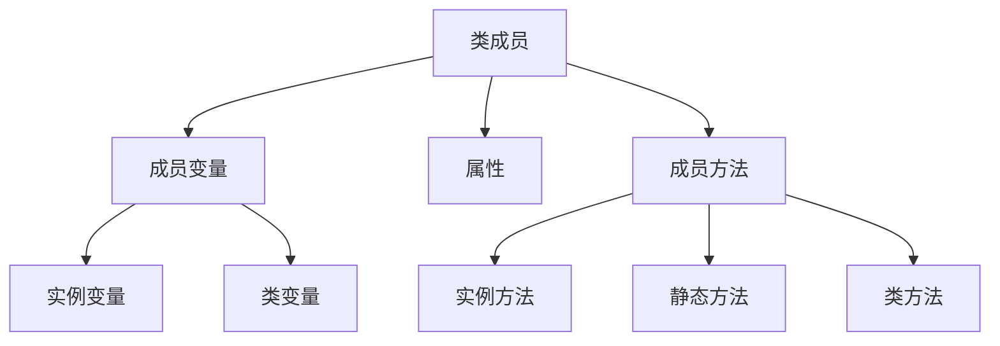
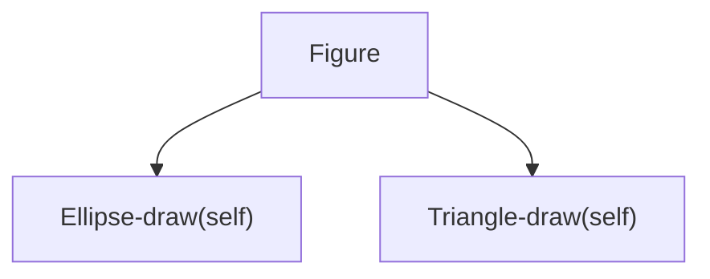
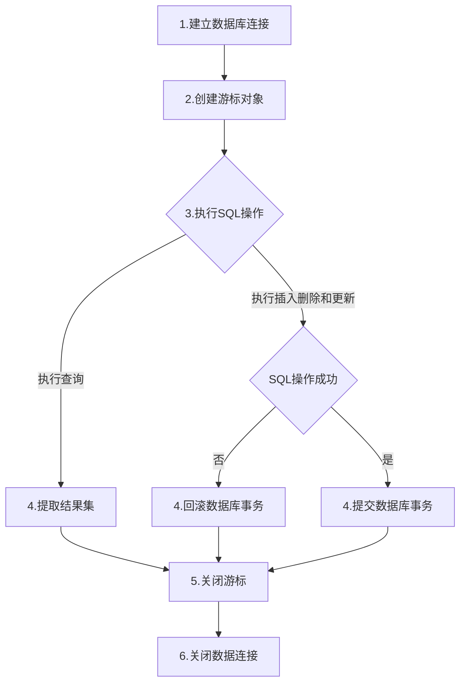

# python基础知识

> 版本：0.0.1
> 参考书目：python从小白到大牛
> 笔记时间：2019.05.16
> 作者：赵青岩
> 邮箱：642226127@qq.com   

[toc]

## 1. 语法基础

### 1.1 标识符和关键字

#### 1.1.1 标识符

&emsp;&emsp;标识符就是变量、常量、函数、属性、类、模块和包等由程序员指定的名字。python中标识符的**命名规则**如下：

- 1. 区分大小写；
- 2. 首字符可以是下划线“_”或字母，但不能是数字；
- 3. 除首字符外，其他字符可以是“_”、字母和数字；
- 4. 关键字不能作为标识符；
- 5. 不能使用内置函数作为标识符。

**注意：**#和$不能构成标识符。

#### 1.1.2 关键字

&emsp;&emsp;python中有33个关键字，其中只有False、None和True首字母大写，其他全部小写。具体如下：

|False|def|if|raise|
|---|---|---|---|
|None|del|import|return|
|Ture|elif|in|try|
|and|else|is|while|
|as|except|lambda|with|
|assert|finally|nonlocal|yield|
|break|for|not||
|class|from|or||
|continue|global|pass||

### 1.2 变量和常量

#### 1.2.1 变量

- python中声明变量不需要指定数据类型。
- 同一变量可以保存多种数据类型，下代码中 y 保存了 true ，还可以保存 20 :

``` python
y = 20
y = True
```
**注意：** python中区分大小写，`y = true` 会报错。
#### 1.2.2 常量

&emsp;&emsp;python中没有特定关键字定义常量，因此只能将变量当做常量来使用，人为不去修改。

### 1.3 注释

&emsp;&emsp;Python中注释使用“#”，#后面有一个空格，接着是注释内容。

``` python
# 注释内容
```

**注意：**

- “#”可以单行注释，也可以多行注释
- 可以在行首，也可以在行尾
- windows环境下一般在python文件的行首需要加:`# coding=utf-8`
- 添加注释快捷键：`CTRL + /`

### 1.4 语句

- python代码是由关键字、标识符、表达式和语句组成的。语句关注代码的执行过程，如if、for和while等。
  
- 在python中一行代码表示一条语句，语句结束可以加分号，也可以省略。

**注意：**

- 1. **连等：** python语句支持连等，即`a = b = c = 10`。
- 2. **缩进：** 
  - 缩进用来界定代码块
  - 一个缩进为一个制表符（Tab）或 4 个空格
  - 不同编译器的制表符不同，因此推荐 4 个空格

### 1.5 模块

&emsp;&emsp;Python中一个模块就是一个文件，模块是保存代码的最小单位，模块中可以声明变量、常量、函数、属性和类等Python程序元素。一个模块提供可以访问另外一个模块中的程序元素。

#### 1.5.1 导入模块 
- 1. 方法一：
  - 写法：`import module`
  - 导入模块所有代码元素，访问时需要加“模块名.”，如`module.y`（y 是模块 module中的变量）

- 2. 方法二：
  - 写法：`from module import y`
  - 导入特定的代码元素，使用时不需要加“模块名.”
  - 当本模块中有变量 y 时，y 不能导入，即 y 是当前模块的变量

**注意：** 模块事实上提供一种命名空间（namespace），统一模块内部不能有名字相同的代码元素，但不同模块可以。

### 1.6 包

&emsp;&emsp;如果两个名字相同的模块，应如何防止命名冲突呢？答案是使用。包提供了一种命名空间。

#### 1.6.1 创建包

&emsp;&emsp;包是按照文件夹的层次结构管理的，每个包下面会有一个`__init__.py`文件，它告诉解释器，这是一个包。这个文件内容一般是空的，但可以编写代码。

#### 1.6.2 导入包

- 方法一：`import pkg1.module as module1`
  - 导入包 pkg1 中模块 module 中所有元素
  - 由于 module 与当前模块重名，因此需要“as”起一个别名
- 方法二：`from pkg1.module import y as z`
  - 导入包 pkg1 中模块 module 中的元素 y
  - 由于 y 与当前模块中的 y 重名，因此需要重新起名

## 2. Python编码规范

### 2.1 命名规范

&emsp;&emsp;Python中命名规范采用多种不同的方式，不同的代码元素命名不同，具体如下：

- 包：全部小写字母，中间可以用“.”分割，不推荐用下划线。作为命名空间，包名要具有唯一性，推荐采用公司或组织域名的倒置，如`com.apple.quicktime.v2`。
- 类：采用大驼峰法命名，如`SplitViewController`。
- 异常：异常属于类，命名同类命名，但应使用`Error`作为后缀，如`FileNotFoundError`。
- 变量：
  - 全部采用小写字母，如果由多个单词构成，可以用下划线隔开。
  - 如果变量应用于模块或函数内部，则变量名可以由单下划线开头；
  - 变量类内部私有使用的变量，命名可以以双下划线开头；
  - 不要命名双下划线开头和结尾的变量，这是Python保留的；
  - 避免使用小写 L 、大写 O 和大写 I 作为变量名。
- 函数和方法：命名同变量名，如`balance_account、_push_cm_exit`。
- 常量：全部大写字母，如果由多个字母构成，可以使用下划线隔开，如`YEAR`和`WEEK_OF_MONTH`。

### 2.2 注释规范

&emsp;&emsp;Python中注释的语法有三种：单行注释、多行注释和文档注释。

#### 2.2.1 文件注释

&emsp;&emsp;文件注释是在每一个文件开头添加注释，采用多行注释。文件注释通常包括如下信息：版权信息、文件名、所在模块、作者信息、历史版本信息、文件内容和作用等。示例如下：

``` python
#
# 版权所有 2015 北京智捷东方科技有限公司
# 许可信息查看 LICENSE.txt 文件
# 描述：
#   实现日期基本功能
# 历史版本：
#   2015-7-22：创建 关东升
#   2015-8-20：添加 socket 库
#   2015-8-22：添加 math 库
#
```

#### 2.2.2 文档注释

&emsp;&emsp;文档注释就是文档字符串，注释内容能够生成 API 帮助文档，可以使用Python官方提供的pydoc工具从Python源代码文件中提取这些信息，也可以生成HTML文件。

- 所有公有的模块、函数、类和方法都应该进行文档注释
- 文档注释推荐使用一对三重双引号`"""`包裹起来，不推荐使用三个单引号`'''`。
- 文档注释位于被注释的模块、函数、类和方法内部的第一条语句
- 如果文档注释一行能够完成，结束的三重双引号也在同一行；如果文档注释很长，第一行注释之后要留一个空行，剩下注释内容换行要与开始三重双引号对齐，最后结束的三重双引号要单独占一行，并与开始的三重双引号对齐。

``` python
def fun1():
    """单行注释"""

def fun2():
    """多行注释，行1
    多行注释，行2
    """

def _fun3():#由变量名命名可知，该函数为模块私有，不需要文档注释
```

#### 2.2.3 代码注释

&emsp;&emsp;文档注释一般是给看不到源码的人看的帮助文档，而代码注释是给阅读源码的人参考的。

- 代码注释一般采用单行注释或多行注释
- 单行注释和多行注释均采用 # 加注释的方式
- 代码注释要求与其后的代码具有一样的缩进级别
- 尾端注释要求注释极短，且注释和代码要留出足够的空白（至少两个空格）

#### 2.2.4 使用 TODO 注释

&emsp;&emsp;TODO注释是一种特殊的标识，表示有待处理或代码没有编写完成。TODO注释不是Python官方所提供，因此vscode中需要添加插件。

##### 2.2.4.1 vscode中安装插件

- TODO代码高亮：TODO Highlight
- TODO树：TODO Tree

##### 2.2.4.2 特殊注释及其含义

- `TODO:`
  - 写法：`TODO:注释`
  - 意义：表示该注释处有功能代码待编写，待实现的功能在注释中简略说明
- FIXME:
  - 写法：`FIXME:注释`
  - 意义：表示该注释处有代码需要修正，甚至代码是错误的，不能工作，需要修复；如何修正在注释中简略说明

### 2.3 导入规范

- 导入语句总是放在文件的顶部，位于模块注释和文档注释之后，模块全局变量和常量之前。
- 每一个导入语句只能导入一个模块，但是from import 后面有多个代码元素是可以的。
- 导入语句应该按照从通用到特殊的顺序分组，顺序是：标准库-第三方库-自己模块。每一组之间有一个空行，且组中模块是按照英文字母顺序排序的。

### 2.4 代码排版

&emsp;&emsp;代码排版包括空行、空格、断行和缩进等内容。

#### 2.4.1 空行

&emsp;&emsp;空行用以将逻辑相关的代码段分开，具体规范如下：

- import 语句前后保留两个空行。
- 函数声明之前保留两个空行。
- 类声明之前保留两个空行。
- 方法声明之前保留一个空行。
- 两个逻辑代码块之间保留一个空行。

#### 2.4.2 空格

&emsp;&emsp;具体规范如下：

- 赋值符号`=`**前后**各有一个空格，例：`a = 19`
- 所有二元运算符都应该用空格与操作数分开，例：`a += c + d`
- 一元运算符：算法运算符取反`-`和运算符取反`~`，例：`a = -b ,y = ~b`
- 作为函数参数时＝前后不用加空格
- 括号内不要有空格，Python中的括号包括`()`、`[]`、`{}`。
  - 推荐写法：`doque(cat[1], {dogs: 2}, [])`
  - 不推荐：`doque(cat[ 1 ], { dogs: 2 }, [ ])`
- 不要在逗号、分号、冒号前面有空格，要在他们后面有空格，除非该符号已经是行尾了。
- 在切片中的冒号前后都不加空格
- 参数列表、索引、切片的左括号前不应有空格。

#### 2.4.3 缩进

&emsp;&emsp;4 个空格常被作为缩进排版的一个级别。虽然可以使用制表符进行缩进，而默认情况下一个制表符等于8 个空格，但是不同的IDE工具中一个制表符与空格对应的个数会有不同，所以不要使用制表符缩进。

#### 2.4.4 断行

&emsp;&emsp;一行代码中最多有79个字符，对于文档注释和多行注释时一行最多72个字符，但是如果注释中包含URL地址可以不受这个限制。否则，超过则需要断行，断行需要按照如下规范：

- 在逗号后面断开
- 在运算符前面断开
- 尽量不要使用续行符 “\” ，当有括号（包括大括号、中括号、小括号）则在括号中断开，这样可以不用续行符。
- 有时为了省略续行符，会将表达式用小括号括起来。

**注：**在Python中反斜杠“\”可以作为续行符使用，告诉编译器当前行和下一行是连续的。但在括号中续行是隐式的。

## 3. 数据类型

&emsp;&emsp;在Python中所有的数据类型都是类，每一个变量都是类的实例。
&emsp;&emsp;Python中有 6 种标准数据类型：数字、字符串、列表、元祖、集合和字典，其中列表、元祖、集合和字典可以保存多项数据，它们每一项都是一种数据结构，统称为“数据结构”类型。

### 3.1 数字类型

&emsp;&emsp;Python数字类型有 4 种：整数类型、浮点类型、复数类型和布尔类型。布尔类型也是数字类型，它事实上是整数类型的一种。

#### 3.1.1 整数类型

&emsp;&emsp;Python整数类型为int，整数类型的范围可以很大，可以表示很大的整数，这只受所在计算机硬件的限制。

#### 3.1.2 浮点类型

&emsp;&emsp;浮点类型主要用来存储小数数值，Python浮点类型为float，Python只支持双精度浮点型，且与本机相关。

&emsp;&emsp;浮点类型可以使用小数表示，也可以使用科学计数法表示；科学计数法中会使用大写或小写的 e 表示10的指数，如`e2`表示10<sup>2</sup>。

#### 3.1.3 复数类型

&emsp;&emsp;Python中复数类型为complex，例如`1+2j`表示的事实部为1、虚部为2的复数。

#### 3.1.4 布尔类型

&emsp;&emsp;Python中布尔类型为bool，bool是int的子类，只有两个值：True 和 False。

**注意：**任何数据类型都可以通过bool()函数转化为布尔值，那些被认为“没有的”、“空的”值会转化为False，反之转化为True。如None（空对象）、False、0、0.0、0j（复数）、""（空字符串）、[]（空列表）、（）（空元祖）和｛｝（空字典）这些数值都会转化为False，否则是True。

### 3.2 数字类型的相互转换

&emsp;&emsp;除复数外，其他的三种数字类型（整数、浮点和布尔）都可以进行相互转换，转换分为隐式类型转换和显式类型转换。

#### 3.2.1 隐式类型转换

&emsp;&emsp;多个数字类型数据之间可以进行数学计算，由于参与进行计算的数字类型可能不同，此时会发生隐式类型转换。计算过程中隐式类型转换规则如下：

|操作数 1 类型|操作数 2 类型|转换后的类型|
|---|---|---|
|布尔|整数|整数|
|布尔、整数|浮点|浮点|

**注意：**

- 布尔数值类型可以隐式转换为整数类型，布尔值True转换为整数 1 ，布尔值False转换为整数 0 。

#### 3.2.2 显式类型转换

&emsp;&emsp;在不能进行隐式转换的情况下，就可以使用转换函数进行显式转换了。除复数外，三种类型（整数、浮点和布尔）都有自己的转换函数，分别是int()、float()和bool()。

- int()函数可以将布尔、浮点和字符串转换为整数。
  - True返回1；False返回0
  - 浮点数值会截掉小数部分
- float()函数可以将布尔、整数和字符串转换为浮点。
  - True返回1.0；False返回0.0
  - 整数返回：整数部分+ `.0`

### 3.3 字符串类型

&emsp;&emsp;由字符主城的一串字符序列成为“字符串”，字符串是有顺序的，从左到右，索引从 0 开始依次开始递增。Python中字符串类型是`str`。

&emsp;&emsp;Python中的字符采用Unicode编码，所以字符串中可以包含中文。

#### 3.3.1 字符串表示方式

&emsp;&emsp;Python中字符串的表示方式有三种：3

- 普通字符串：采用单引号 `'` 或双引号 `"` 包裹起来的字符串。
  - 单引号或双引号不用转义字符的情况：在包含单引号的字符串中使用双引号、在包含双引号的字符中使用单引号
- 原始字符串(raw string):在普通字符串前加 r ，字符串中的特殊字符不需要转义，按照字符串的本来面目呈现。
- 长字符串：字符串中包含了换行缩进等排版字符，可以使用三重单引号或三重双引号包裹起来。
  - 长字符串中如果包含有特殊字符，也需要转义

#### 3.3.2 字符串格式化

&emsp;&emsp;将其他类型变量与字符串拼接到一起并进行格式化输出，如计算的金额需要保留小数点后四位，数字需要左对齐等。

##### 3.3.2.1 字符串格式化的方式

&emsp;&emsp;在字符串格式化时可以使用字符串的 fromat() 方法以及占位符
  - 占位符用参数索引表示：
    ```python
    s = '{0}的芳龄是{1}。'.format(name, age)
    ```
  - 占位符使用参数的名字来表示：
    ```python
    s = '{n}的芳龄是{m}岁。'.format(n=name, a=age)
    ```

&emsp;&emsp;字符串格式化也可以使用%来作为占位符，例如`s = '%s的芳龄是%d。' % (name, age)`

##### 3.3.2.2 字符串格式化控制符

&emsp;&emsp;占位符中还有格式化控制符，可以对字符串的格式进行更加精准的控制，格式化控制符如下表：

  |控制符|说明|
  |:---|:---|
  |s|字符串格式化|
  |d|十进制整数|
  |f、F|十进制浮点数|
  |g、G|十进制整数或浮点数|
  |e、E|科学计算法表示浮点数|
  |o|八进制整数，符号是小写英文字母O|
  |x、X|十六进制，x是小写表示，X是大写表示|

&emsp;&emsp;格式化控制符使用方法：格式化控制符位于占位符索引或占位符名字的后面，之间用冒号隔开，示例如下：

```python
"{0}的芳龄是{1:d}岁".format(name, age)

# {1:5d}是指定输出长度为5的字符串，不足用空格补齐
"{0}的芳龄是{1:5d}岁".format(name, age)

# {1:.2f}是指输出保留2位小数的浮点数
"{0}今天的收入是{1:.2f}".format(name, money)

# {1:10.2f}是指输出10位字符，其中包括小数点和小数部分，不足的用空格补齐
"{0}今天的收入是{1:10.2f}".format(name, money)
```

#### 3.3.3 字符串查找

&emsp;&emsp;字符串类（str）中提供了find 和 rfind 方法用于查找子字符串，返回值是查找到的子字符串所在的位置，没有找到返回 -1。

- str.find(sub[, start[, end]]):
  - 说明：在索引 start 到 end 之间查找子字符串 sub，如果找到，则返回最左端位置的索引，如果没有找到返回 -1
  - start 是开始索引，end 是结束索引，这两个参数可以省略
    - 如果 start 省略说明查找从字符串头开始
    - 如果 end 省略，则查找到字符串结尾
    - 如果全都省略，就是查找全部
- str.rfind(sub[, start[, end]]):
  - 与 find 方法类似，区别是如果找到，则返回最右端位置的索引
  - 如果在查找的范围内只找到一处字符串，那么两个方法返回值一致

**注意：** 在Python文档中`[]`表示可以省略部分，find 和 rfind 方法参数[, start[, end]]表示 start 和 end 都可以省略。

**示例：**

```python {.line-numbers}
source_str = "There is a string accessing example."

# len()返回字符串的长度，结果为：36
len(source_str)

# 用[d]取对应位置的字符串,返回：'g'
source_str[16]

# 用find查找'r'，返回：3
source_str.find('r')

# 用rfind查找'r',返回：13
source_str.rfind('r')

# 用find全参数查询，返回：24
source_str.find('ing', 18, 28)
```

**注意：** 
- len 是函数，不是字符串的一个方法，它的参数是字符串。
- 函数与方法的区别是：方法是定义在类中的函数，在外部调用时需要通过类或对象调用；函数不是类中定义的，也称为顶层函数，它们不属于任何一个类，调用时直接使用函数即可。

#### 3.3.4 字符串与数字的相互转换

##### 3.3.4.1 字符串转换为数字

&emsp;&emsp;字符串转换为数字可以使用 int() 和 float() 函数实现，如果字符串成功转换为数字，则返回数字，否则引发异常。

```python {.line-numbers}
int('9')  # 返回：9
int('9.6')  # 报错
float('9.6')  # 返回：9.6
int('AB')  # 报错
int('AB', 16)  # 返回：171，其中 16 表示十六进制
```

##### 3.3.4.2 数字转换为字符串

&emsp;&emsp;数字转换为字符串的方法很多，其中6.3.2节介绍的字符串格式化就是其中一种；另外，Python中提供了 str() 函数，该函数可以将任何类型的数字转换为字符串。

**示例：**

```python {.line-numbers}
str(3.24)  # Out: '3.24'
str(True)  # Out: 'True'
str([])  # Out: '[]'
str([1,2,3])  # Out: '[1, 2, 3]'

# 加格式的写法
'{0:.2f}'.format(3.24)  # Out: '3.24'
'{:.1f}'.format(3.24)  # Out: '3.2'
```

## 4. 运算符

### 4.1 算术运算符

&emsp;&emsp;Python中的算术运算符用来组织整型和副段兴数据的算术运算，按照参加运算的操作数不同可以分为一元运算符和二元运算符。

#### 4.1.1 一元运算符

&emsp;&emsp;Python中一元运算符有多个，但是一元算术运算符只有一个：`-`,`-`是取反操作。

#### 4.1.2 二元运算符

&emsp;&emsp;二元运算符包括+、-、*、/、%、**、和//，这些运算符主要是对数字类型数据进行操作；其中 `+` 和 `*` 可以用于字符串、元祖和列表等类型的数据操作。

|运算符|名称|说明|例子|
|---|---|:---|---|
|+|加|可用于数字、序列等数据类型；对于数字类型是求和，对于其他类型是连接操作|a + b|
|-|减|求a减b的差|a - b|
|*|乘|可用于数字、序列等数据类型；对于数字类型是求积，其他类型是重复操作|a * b|
|/|乘|求a除以b的商|a / b|
|%|取余|求a除以b的余数|a % b|
|**|幂|求a的b次幂|a ** b|
|//|地板除法|求小于a/b商的最大整数|a // b|

**示例：**

```python {.line-numbers}
# 求余操作，Out：1
3 % 2

# 地板除法，Out：1
3 // 2

# 地板除法，Out：-2
-3 // 2

# 幂运算，Out：100
100 ** 2

# 混合运算，Out：13.0
10.0 + True + 2

# 字符串相加，Out：'HelloWorld'
'Hello' + 'World'

# 字符串的乘法，Out：'HelloHello'
'Hello' * 2
```

### 4.2 关系运算符

&emsp;&emsp;关系运算是比较两个表达式大小关系的运算，结果是布尔类型数据。关系运算符共有6种：

|运算符|名称|例子|说明|
|---|:---|---|:---|
|==|等于|a == b|相等返回True，否则返回False|
|!=|不等于|a != b|与==相反|
|>|大于|a > b|大于返回True，否则返回False|
|<|小于|a < b|小于返回True，否则返回False|
|>=|大于等于|a >= b|大于等于返回True，否则返回False|
|<=|小于等于|a <= b|小于等于返回True，否则返回False|

**示例：**

```python {.line-numbers}
# 1. 浮点数与整数对比，Out: True
1.0 == 1

# 2. 字符串、列表和元祖类型对比

# 2.1 字符串对比
# 2.1.1 等于
a = 'Hello'
b = 'Hello'
a == b  # Out:True

# 2.1.2 大于
a = 'World'
a > b  # Out:True

# 2.2 列表对比
#2.2.1 等于
a = [1，2]
b = [1, 2]
a == b  # Out:False

# 2.2.2 小于
a = []
a < b  # Out:True
```

### 4.3 逻辑运算符

&emsp;&emsp;逻辑运算对布尔类型进行运算，其结果也是布尔类型。

|运算符|名称|例子|说明|
|---|---|---|:---|
|not|逻辑非|not a|返回结果与a相反|
|and|逻辑与|a and b|a、b全为True时，返回True；否则返回False|
|or|逻辑或|a or b|a、b全为False时，返回False，否则返回True|

**注意：**Python中的逻辑与和逻辑或都采用短路设计。

### 4.4 位运算符

&emsp;&emsp;位运算符是以二进制（bit）为单位进行运算的，操作数和结果都是整型数据。

|运算符|名称|例子|说明|
|---|---|---|:---|
|~|位反|~x|将x的值按位取反|
|&|位与|x & y|对应位同为1时为1，否则为0|
|\||位或|x \| y|对应位同为0时为0，否则为1|
|^|位异或|x ^ y|对应位相反时为1，否则为0|
|>>|右移|x >> a|x右移a位，高位采用符号位补位|
|<<|左移|x << a|x左移a位，地位用0补位|

**示例：**

```python {.line-numbers}
a = 0b10110010
b = 0b01011110

print("a | b = {0}".format(a | b))  # 0b11111110
print("a & b = {0}".format(a & b))  # 0b00010010
print("a ^ b = {0}".format(a ^ b))  # 0b11101100
print("~a = {0}".format(~a))  # -179
print("a >> 2 = {0}".format(a >> 2))  # 0b00101100
print("a << 2 = {0}".format(a << 2))  # 0b11001000
```
```
    Out:
    a | b = 254
    a & b = 18
    a ^ b = 236
    ~a = -179
    a >> 2 = 44
    a << 2 = 712
```

**注意：**右移n位，相当于操作数除以2<sup>n</sup>；左移n位，相当于乘以2<sup>n</sup>。

### 4.5 赋值运算符

&emsp;&emsp;赋值运算符只是一种简写，一般用于变量自身的变化，具体如下：

|运算符|名称|例子|说明|
|---|:---|---|:---|
|+=|加赋值|a += b|等价于a = a + b|
|-=|减赋值|a -= b|等价于a = a - b|
|*=|乘赋值|a *= b|等价于a = a * b|
|/=|除赋值|a /= b|等价于a = a / b|
|%=|取余赋值|a %= b|等价于a = a % b|
|**=|幂赋值|a **= b|等价于a = a ** b|
|//=|地板除法赋值|a //= b|等价于a = a // b|
|&=|位与赋值|a &= b|等价于a = a & b|
|\|=|位或赋值|a \|= b|等价于a = a \| b|
|^=|位异或赋值|a ^= b|等价于a = a ^ b|
|<<=|左移赋值|a <<= b|等价于a = a << b|
|>>=|右移赋值|a >> b|等价于a = a >> b|

**示例：**

```python {.line-numbers}
a += b + 3  # 相当于：a = a + b + 3
```

### 4.6 其他运算符

&emsp;&emsp;主要讲两个“测试”运算符，其中“测试”是判断之意，他们的运算结果是布尔值，它们数据关系运算符。

#### 4.6.1 同一性测试运算符

&emsp;&emsp;同一性测试运算符是测试两个对象是否是同一个对象，类似于 `==` ，不同之处在于`==`是测试两个对象的内容是否相同。
&emsp;&emsp;同一性测试运算符有两个：is和is not，is是判断是同一对象，is not是判断不是同一对象。

**示例：**

```python {.line-numbers}
class Person:
    def __init__(self, name, age):
        self.name = name
        self.age = age
        
p1 = Person('Tony', 18)
p2 = Person('Tony', 18)

print(p1 == p2)  # Out:False
print(p1 is p2)  # Out:False
```

**注释：**第9行结果为False的原因是`==`没有明确对比规则，这里需要重写__eq__方法，指定比较规则，修改如下：

```python {.line-numbers}
class Person:
    def __init__(self, name, age):
        self.name = name
        self.age = age

    def __eq__(self, other):
        if self.name == other.name and self.age == other.age:
            return True
        else:
            return False

p1 = Person('Tony', 18)
p2 = Person('Tony', 18)

print(p1 == p2)  # Out:True
print(p1 is p2)  # Out:False
```

#### 4.6.2 成员测试运算符

&emsp;&emsp;成员测试运算符可以测试在一个序列（sequence）对象中是否包含某一元素。
&emsp;&emsp;成员测试运算符有 in 和 not in。

**示例：**

```python {.line-numbers}
string_a = 'Hello'
print('e' in string_a)  # Out:True

list_a = [1, 2]
print(2 in list_a)  # Out:True
```

### 4.7 运算符优先级

&emsp;&emsp;优先级从上到下，从高到低，同一行优先级相同：

|优先级|运算符|说明|
|---|:---|:---|
|1|()|小括号|
|2|f(参数)|函数调用|
|3|[start:end],[start:end:step]|分片|
|4|[index]|下标|
|5|.|引用类成员|
|6|**|幂|
|7|~|位反|
|8|+,-|正负号|
|9|*,/,%|乘法，除法，取余|
|10|+，-|加法，减法|
|11|<<,>>|位移|
|12|&|位与|
|13|^|位异或|
|14|\||位或|
|15|in, not in, is not, <,<=,>,>=,<>,!=,==|比较|
|16|not|逻辑非|
|17|and|逻辑与|
|18|or|逻辑或|
|19|lambda|Lambda表达式|

**注意：**如果对于优先级不确定的情况，可以使用（）。

## 5. 控制语句

&emsp;&emsp;程序设计中的控制语句有三种，即顺序、分支和循环语句。Python中的控制语句有以下几类：

- 分支语句：if
- 循环语句：while 和 for
- 跳转语句：break、continue 和 return

### 5.1 分支语句

&emsp;&emsp;分支语句又称为条件语句。Python中的分支语句只有if语句。
&emsp;&emsp;if语句有if结构、if-else 结构和 elif 结构三种。

#### 5.1.1 if结构

&emsp;&emsp;如果条件为True则执行语句组，否则就执行if结构后面的语句。语法结构如下：

```python {.line-numbers}
if 条件:
    语句组
```

**示例：**

```python {.line-numbers}
if 1 < 2:
    print("if语句")
```

#### 5.1.2 if-else结构

&emsp;&emsp;语法结构如下：

```python {.line-numbers}
if 条件:
    语句组1
else:
    语句组2
```

**示例：**

```python {.line-numbers}
score = 80

if score >= 60:
    print("及格")
    if score >= 90:
        print("优秀")
else:
    print("不及格")
```

#### 5.1.3 elif结构

&emsp;&emsp;语法结构如下：

```python {.line-numbers}
if 条件1：
    语句组1
elif 条件2：
    语句组2
else:
    语句组n
```

#### 5.1.4 三元运算符替代品-条件表达式

&emsp;&emsp;Python中没有类似Java中的三元运算符，Python提供了条件表达式来实现对应功能：`表达式1 if 条件 else 表达式2`，其中条件为True时，返回表达式1，否则返回表达式2。

**示例：**
```python {.line-numbers}
result = '及格' if score >= 60 else '不及格'
```

### 5.2 循环语句

&emsp;&emsp;Python支持while和for两种循环构造类型。

#### 5.2.1 while语句

&emsp;&emsp;while是一种先判断的循环结构，语法如下：

```python {.line-numbers}
while 循环条件：
    语句组
[else:
    语句组]
```

**示例：**

```python {.line-numbers}
i = 0

while i * i < 100_000:
    i += 1

print("i = %d" % i)  # Out:i = 317
print("i * i = %d" % (i * i))  # Out:i * i = 100489
```

**注释：** 上述例子中第3行，为方便阅读，整数和浮点数局可以添加多个0或下划线以提高可读性，如000.01563和_360_000，两种格式均不会影响实际值。一般是每三位加一个下划线。

#### 5.2.2 for语句

&emsp;&emsp;Python语言中没有C语言风格的for语句，它的for语句相当于java中增强for循环语句，只用于序列，序列包括字符串、列表和元祖。

```python {.line-numbers}
for 迭代器变量 in 序列：
    语句组
[else:
    语句组]
```

**示例：**

```python {.line-numbers}
# 范围
for num in range(1, 10):
    print("{0} * {0} = {1}".format(num, num * num))
    
# 字符串
for item in 'Hello':
    print(item)
    
# 列表
numbers = [1,3,4]

for item in numbers:
    print("Count is : {0}".format(item))
```

### 5.3 跳转语句

&emsp;&emsp;Python中跳转语句有3种：break、continue和return。

#### 5.3.1 break语句

&emsp;&emsp;break语句可用于while和for循环结构，它的作用是强行退出循环体，不再执行循环体中剩余的语句。

**示例：**

```python {.line-numbers}
for item in range(10):
    if item == 3:
        break
    print("Count is : {0}".format(item))
```

#### 5.3.2 continue语句

&emsp;&emsp;continue语句用来结束本次循环，跳过循环体中尚未执行的语句，接着进行终止条件的判断，已决定是否继续循环。

**示例：**

```python {.line-numbers}
for item in range(10):
    if item == 3:
        continue
    print("Count is : {0}".format(item))
```

#### 5.3.3 while和for语句中的else语句

&emsp;&emsp;这里的else和if语句中的else不同，它是在循环体正常结束时才运行的代码，但是当循环中断时（break、return和异常抛出）else语句将不被执行。

**示例：**

```python {.line-numbers}
i = 0

while i * i < 10:
    i += 1
    print("{0} * {0} = {1}".format(i, i * i))
else:
    print('While over!')  # 执行

print("*" * 10)

i = 0
while i * i < 10:
    if i == 3:
        break
    i += 1
    print("{0} * {0} = {1}".format(i, i * i))
else:
    print('While over!')  # 不执行
```
    Out:
    1 * 1 = 1
    2 * 2 = 4
    3 * 3 = 9
    4 * 4 = 16
    While over!
    **********
    1 * 1 = 1
    2 * 2 = 4
    3 * 3 = 9

### 5.4 使用范围

&emsp;&emsp;范围在Python中类型是range，表示一个整数序列，创建范围对象使用range()函数，语法如下：

- 写法：`range([start,] stop[, step])`
- 参数：三个参数都是整数类型，start是开始值，可以省略，表示从0开始；stop是结束值；step是步长。
- start <= 整数序列取值 < stop,步长step可以为负数，用来创建递减序列。

**示例：**

```python {.line-numbers}
# 从1开始，步长为2，递增
for item in range(1, 10, 2):
    print("Count is : {0}".format(item))

# 从1开始，步长为-3，递减
for item in range(1, -10, -3):
    print("Count is : {0}".format(item))
```

## 6. 数据结构

&emsp;&emsp;Python中数据结构主要有序列、集合和字典。

&emsp;&emsp;Python中没有数组结构，因为数组结构要求元素类型一致，Python作为动态类型语言，不强制声明变量的数据类型，也不强制检查元素的数据类型，因此Python中没有数组结构。

### 6.1 元祖

&emsp;&emsp;元祖（tuple）是一种序列（sequence）结构。

#### 6.1.1 序列

&emsp;&emsp;序列是一种可迭代的、元素有序、可以重复出现的数据结构，序列可以通过索引访问元素。

&emsp;&emsp;序列包括的结构有列表（list）、字符串（str）、元祖、范围（range）和字节序列（bytes）。序列可进行的操作有**索引**、**分片**、**加**和**乘**。

##### 6.1.1.1 索引操作

&emsp;&emsp;序列中第一个元素的索引是0，其他元素的索引是第一个元素的偏移量。

- 可以有正偏移量，称为正值索引；也可以有负偏移量，称为负值索引。
- 正值索引的最后一个元素索引是“序列长度 - 1”，负值索引最后一个元素索引是“-1”。
- 序列中的元素是通过索引下标访问的，即中括号[index]方式访问。

**示例：**

```python {.line-numbers}
a = 'Hello'

# 正值索引
a[0]  # Out:'H'
a[1]  # Out:'e'

# 负值索引
a[-1]  # Out:'o'
a[-2]  # Out:'l'

# 大小
max(a)  # Out:'o'
min(a)  # Out:'H'

# 长度
len(a)  # Out:5
```

##### 6.1.1.2 序列的加和乘

&emsp;&emsp;`+`运算符可以将两个序列连接起来，`*`运算符可以将序列重复多次。

**示例：**

```python {.line-numbers}
a = 'Hello'

a * 3  # Out:'HelloHelloHello'
a += ' World'  # Out:'Hello World'
```

##### 6.1.1.3 序列分片

&emsp;&emsp;序列的分片（Slicing）就是从序列中切分出小的子序列。分片使用分片运算符，分片运算符有两种形式：
- 形式1：[start:end]: start是开始索引，end是结束索引
- 形式2：[start:end:step]:start是开始索引，end是结束索引，step是步长，步长是在分片时获取元素的间隔。步长可以为正整数，也可以为负整数。

**注意：** 切下的分片包括start位置元素，但不包括end位置元素，start和end都可以省略。

**示例：**

```python {.line-numbers}
a = 'Hello'

# 形式1：
a[1:3]  # Out:'el'
a[:3]  # Out:'Hel'
a[0:]  # Out:'Hello'
a[:]  # Out:'Hello'
a[1:-1]  # Out:'ell'

# 形式2：
a[1:5:2]  # Out:'el'
a[0:3:2]  # Out:'Hl'
a[::-1]  # Out:'olleH'
```

**注释：** 第13行，分片的结果是原始字符的倒置。

#### 6.1.2 创建元祖

&emsp;&emsp;元祖是一种不可变序列，一旦创建就不可修改。创建元祖可以使用tuple（[iterable]）函数或直接用逗号“，”将元素分隔。

**示例：**

```python {.line-numbers}
c = (1, 2, 3, 4)
d = ('Hello', 'World', 1, 2, 3)  # 混合的元祖
e = tuple([1, 2, 3, 4])  # 使用tuple函数

# 特殊情况
i = (21)
type(i)  # Out:int

i = (21,)
type(i)  # Out:tuple

i = ()
type(i)  # Out:tuple
```

#### 6.1.3 访问元祖

&emsp;&emsp;元祖作为序列，可以通过下标索引访问其中的元素，也可以对其进行分片。

**示例：**

```python {.line-numbers}
a = ('Hello', 'World', 1, 2, 3)
a[1]  # Out:'World'
a[1:3]  # Out:('World', 1)
a[2:]  # Out:(1, 2, 3)
a[:2]  # Out:('Hello', 'World')
```

&emsp;&emsp;元祖还可以进行拆包操作，就是将元祖的元素赋值给不同的变量。接受拆包元素的变量个数应当小于等于元祖的个数。

**示例：**

```python {.line-numbers}
a = ('Hello', 'World', 1, 2, 3)
str1, str2, n1, n2, n3 = a
str1, _, n1, n2, _ = a

str1, str2, *n = a  
print(n)  # Out:[1, 2, 3]
```

**注释：**

- 第2行：接受拆包元素的变量个数应当等于元祖的元素个数
- 第3行：当接受拆包元素的变量个数小于元祖的元素个数时，应当使用“_”来占位。
- 第5行：变量n前面有星号，表示将剩下的元素作为一个列表赋值给变量n。

#### 6.1.4 遍历元祖

&emsp;&emsp;一般用for遍历元祖。

**示例：**

```python {.line-numbers}
a = (21, 32, 43, 45)

for item in a:
    print(item)
    
for i, item in enumerate(a):
    print('{0} - {1}'.format(i, item))
```

**注释：**

- 第6行：其中enumerate(a)函数可以获得元祖对象，该元祖对象有两个元素，第一个元素是索引，第二个元素是数值。所以（i，item）是元祖拆包的过程，最后变量i是元祖a的当前索引，item是元祖a的当前元素值。
- 该元祖的遍历方法适用于所有序列，如字符串、范围和列表等。

### 6.2 列表

&emsp;&emsp;列表（list）也是一种序列结构，与元祖不同，里诶博爱具有可变性，可以追加、插入、删除和替换列表中的元素。

#### 6.2.1 列表的创建

&emsp;&emsp;创建列表可以使用list([iterable])函数，或者使用中括号将元素括起来，元素之间用逗号分隔。

**示例：**

```python {.line-numbers}
a = [10]  # 说明：a的类型为列表
a = [10,]

# 利用list函数生成列表
list((20, 10, 50, 40, 30))  # Out:[20, 10, 50, 40, 30]
```

**注意：** 通过list函数创建列表是，参数iterable是任何可以迭代的对象，代码第5行中元祖是可迭代对象，因此可以作为参数创建列表。

#### 6.2.2 追加元素

&emsp;&emsp;列表中追加单个元素可以使用append（）方法。如果想追加另一个列表，可以使用 `+` 运算符或extend（）方法。

**示例：**

```python {.line-numbers}
student_list = ['张三', '李四', '王五']

# 追加单个元素
student_list.append('董六')

# 追加另外一个列表：使用+号
student_list += ['刘备', '关羽']

# 追加另外一个列表：使用extend()
student_list.extend(['张飞', '赵云'])
```

#### 6.2.3 插入元素

&emsp;&emsp;插入元素可以使用列表的方法:insert()，该方法可以在指定索引位置插入一个元素。

**示例：**

```python {.line-numbers}
student_list = ['张三', '李四', '王五']
student_list.insert(2, '刘备')  # student_list:['张三', '李四', '刘备', '王五']
```

#### 6.2.4 替换元素

&emsp;&emsp;列表具有可变性，通过列表下标将索引元素放在赋值符号 “=” 左边，进行赋值即可替换。

**示例：**

```python {.line-numbers}
student_list = ['张三', '李四', '王五']
student_list[0] = "诸葛亮"
```

#### 6.2.5 删除元素

&emsp;&emsp;列表中实现删除元素有两种方式，一种是使用列表的remove（）方法，另一种是使用列表的pop（）方法。

##### 6.2.5.1 remove()方法

&emsp;&emsp;remove()方法从左到右查找列表中的元素，如果找到匹配元素则删除；如果找到多个匹配元素，只删除第一个；如果没有找到则会抛出错误。

**示例：**

```python {.line-numbers}
student_list = ['张三', '李四', '王五', '王五']
student_list.remove('王五')  # student_list = ['张三', '李四', '王五']
```

##### 6.2.5.2 pop()方法

&emsp;&emsp;pop()方法也会删除列表中的元素，但它会将成功删除的元素返回。
> 语法如下：
> item = list.pop([i])
> 其中参数i是指定删除元素的索引，i可以省略，表示删除最后一个元素。返回值item是删除的元素。

**示例：**

```python {.line-numbers}
student_list = ['张三', '李四', '王五']

# 参数省略，删除最后一个元素
a_list = student_list.pop()  # Out:['王五']

# 指定参数，删除指定索引的值
a_list = student_list.pop(0)  # Out：['张三']
```

#### 6.2.6 其他常用方法

&emsp;&emsp;列表还有很多其他方法：

- reverse():倒置列表；
- copy():复制列表；
- clear():清除列表中的所有元素；
- index(x[, i[, j]]):返回查找x第一次出现的索引，i是开始查找索引，j是结束查找索引，该方法继承自序列，元祖、字符串也可以使用该方法；
- count(x):返回x出现的次数，该方法继承自序列，元祖和字符串也可以用该方法。

**示例：**

```python {.line-numbers}
a = [21, 32, 43, 45]
# 倒置列表
a.reverse()

# 复制列表
b = a.copy()

# 清空列表元素
b.clear()

# 计数
a.count(32)

# 查找索引
d = a.index(21)
d = a.index(21, 1, 3)
```

#### 6.2.7 列表推导式

&emsp;&emsp;Python中有一种特殊的表达式——推导式，他可以将一种数据结构作为输入，经过过滤、计算等处理，最后输出另一种数据结构。根据数据结构的不同可以分为列表推导式、集合推导式和字典推导式。下面为列表推导式：

```python {.line-numbers}
# 获取0~9中偶数的平方数列表
n_list = [x ** 2 for x in range(10) if x % 2 == 0]

# 多条件表达
m_list = [x for x in range(100) if x % 2 == 0 if x % 5 == 0]
```

**注释：**

- 输出表达式：x ** 2
- 元素变量：for x in range(10)
- 条件语句：if x % 2 == 0
- 第三行：列表推导式有两个条件语句，他们是“与”的关系

### 6.3 集合

&emsp;&emsp;集合是一种可迭代的、无序的、不能包含重复元素的数据结构。

&emsp;&emsp;与序列比较，序列中的元素是有序的，可以重复出现，而集合中的元素是无序的，且不能有重复元素。序列强调的事有序，集合强调的事不重复。当不考虑顺序，而且没有重复的元素时，序列和集合可以相互替换。

&emsp;&emsp;集合又分为可变集合（set）和不可变集合（frozenset）。

#### 6.3.1 创建可变集合

&emsp;&emsp;可变集合类型是set，创建可变集合使用set（[iterable]）函数，或者用大括号｛｝将元素括起来，元素之间用逗号分隔。

```python {.line-numbers}
a = {'张三', '李四', '王五'}

len(a)  # Out:3

# 创建含有重复元素的集合时，自动剔除重复元素
a = {'张三', '李四', '王五', '王五'}
# 使用set函数创建集合
b = set((20, 10, 50, 40, 30))
# 创建空集合，必须用set函数
c = {}  # c的类型为字典，不是集合（dict）
c = set()  # c的类型为集合（set）
```

**注释：** 第6行：由于含有重复元素“王五”，因此创建时自动删除重复的“王五”，a中只有3个元素。

#### 6.3.2 修改可变集合

&emsp;&emsp;修改可变集合的几个常用方法：

- add(elem):添加元素，如果元素已经存在则不能添加，不会抛出错误；
- remove(elem):删除元素，如果元素不存在，则会抛出错误；
- discard(elem):删除元素，如果元素不存在，不会抛出错误；
- pop():删除返回集合中任意一个元素，返回值是删除的元素；
- clear():清除集合。

**示例：**

```python {.line-numbers}
student_set = {'张三', '李四', '王五'}
# 添加元素
student_set.add('董六')
# remove删除元素
student_set.remove('李四')
student_set.discard('王五')
student_set.pop()
# 清除集合
student_set.clear()
```

#### 6.3.3 遍历集合

&emsp;&emsp;集合是无序的，没有索引，不能通过下标访问单个元素。但可以遍历集合，访问集合每一个元素。

**示例：**

```python {.line-numbers}
student_set = {'张三', '李四', '王五'}

for item in student_set:
    print(item)

# 使用enumberate获取集合遍历的次数 
for i, item in enumerate(student_set):
    print('{0} - {1}'.format(i, item))
```

**注释：** 第7行：i获取的不是索引，而是遍历集合的次数。

#### 6.3.4 不可变集合

&emsp;&emsp;不可变集合的类型是frozenset,创建不可变集合应使用frozenset([iterable])函数，不能使用｛｝。

**示例：**

```python {.line-numbers}
student_set = frozenset({'张三', '李四', '王五'})
```

**注意：** 不可变集合被创建后不可被修改。

#### 6.3.5 集合推导式

&emsp;&emsp;集合推导式与列表推导式类似，区别只是输出结构是集合。

**示例：**

```python {.line-numbers}
n_list = {x for x in range(100) if x % 2 == 0 if x % 5 == 0}
```

**注意：** 由于集合是不可重复的，因此集合推导式输出的结果会过滤掉重复的元素。

### 6.4 字典

&emsp;&emsp;字典（dict）是可迭代的、可变的数据结构，通过键来访问元素。字典结构比较复杂，它是由两部分视图构成的，一个是键（key）视图，另一个是值（value）视图。键视图不能包含重复元素，而值集合可以，键和值是成对出现的。

#### 6.4.1 创建字典

&emsp;&emsp;字典类型是dict,创建字典可以使用dict()函数，或者使用大括号｛｝将“键：值”对括起来，键和值之间用冒号分隔。

**示例：**

```python {.line-numbers}
# 用大括号创建
dict1 = {102:'张三', 105:'李四', 109:'王五'}
# 使用dict函数创建:字典作为参数
dict({102:'张三', 105:'李四', 109:'王五'})
# 使用dict函数创建：元祖作为参数
dict(((102, '张三'), (105, '李四'), (109, '王五')))
# 使用dict函数创建：列表作为参数
dict([(102, '张三'), (105, '李四'), (109, '王五')])
# 使用dict函数创建：zip函数作为参数
dict(zip([102, 105, 109], ['张三', '李四', '王五']))
# 使用dict函数创建：key=value作为参数
dict(a = '张三', b = '李四', c = '王五')
```

**注释：** 第12行：使用key = value形式作为参数创建字典时，key必须是字符串，字符串型的数字也不可以。

#### 6.4.2 修改字典

&emsp;&emsp;字典可以被修改，但都是针对键和值的同时操作，修改字典包括添加、替换和删除“键：值”对。

**示例：**

```python {.line-numbers}
dict1 = {102:'张三', 105:'李四', 109:'王五'}
# 添加
dict1[110] = '董六'
# 修改
dict1[102] = '李四'
# 删除
del dict1[109]  # 如果键不存在，会抛出错误
dict1.pop(105)
dict1.pop(105, '董六')
dict1.popitem()  # 随机删除其中一个元素
```

#### 6.4.3 访问字典

&emsp;&emsp;字典还需要一些方法来访问它的键或值：

- get(key[, default]):通过键返回值，如果键不存在则返回默认值
- items():返回字典的所有键值对
- keys():返回字典键视图
- values()：返回字典值视图
- in和not in 运算符：in和not in运算符只在测试键视图中进行

**示例：**

```python {.line-numbers}
dict1 = {102:'张三', 105:'李四', 109:'王五'}
# 获取
dict1.get(105)
dict1.get(101, '董六')
# 获取所有键值对
dict1.ietms()
# 获取键视图和值视图
dict1.keys()
dict1.values()
# in 和 not in
102 in dict1  # Out:True
```

#### 6.4.4 遍历字典

&emsp;&emsp;与集合不同，字典有两个视图，因此遍历过程可以只遍历值视图，也可以只遍历键视图，也可以同时遍历。遍历过程都是通过for循环实现的。

**示例：**

```python {.line-numbers}
student_dict = {102:'张三', 105:'李四', 109:'王五'}
# 遍历键视图
for student_id in student_dict.keys():
    print("学号：" + str(student_id))
    
# 遍历值视图
for student_name in student_dict.values():
    print('学生：' + student_name)
    
# 同时遍历键视图和值视图
for student_id, student_name in student_dict.items():
    print('学号：{0} - 学生：{1}'.format(student_id, student_name))
```

#### 6.4.5 字典推导式

**示例：**

```python {.line-numbers}
input_dict = {'one': 1, 'two': 2, 'three': 3, 'four': 4}

output_dict = {k: v for k, v in input_dict.items() if v % 2 == 0}  # Out:{'two': 2, 'four': 4}
keys = [k for k, v in input_dict.items() if v % 2 == 0]  # Out:['two', 'four']
```

## 7. 函数式编程

&emsp;&emsp;程序中反复执行的代码可以封装在一个代码块中，这个代码块具有函数名、参数和返回值，这就是程序中的函数。

&emsp;&emsp;Python中的函数很灵活，在模块中、但是在类之外定义的称为函数，其作用域为当前模块；在别的函数中定义，称为嵌套函数；在类中定义，称为方法。

### 7.1 定义函数

&emsp;&emsp;Python作为解释性语言，其函数必须先定义后调用，也就是定义函数必须在调用函数之前，否则就会发生错误。

&emsp;&emsp;Python中有内置函数，如len（）、min()和max()；也可以自定义函数，语法如下：

```python
def 函数名（参数列表）：
    函数体
    return 返回值
```

**注意：** 如果函数有返回数据，则在return后将数据返回；如果没有返回数据，则函数体可以使用return None 或省略return语句。

### 7.2 函数参数

#### 7.2.1 使用关键字参数调用函数

&emsp;&emsp;为提高函数调用的可读性，在函数调用时可以使用关键字参数调用。采用关键字参数调用函数，在函数定义时不需要做额外工作。

**示例：**

```python {.line-numbers}
def print_area(width, height):
    area = width * height
    print("{0} * {1} 长方形的面积：{2}".format(width, height, area))
    
print_area(320.0, 480.0)  # 没有采用关键字参数调用函数
print_area(width = 320.0, height = 480)  # 采用关键字参数函数调用
print_area(320.0, height = 480.0)  # 采用关键字参数函数调用
# print_area(width = 320.0, heitht)  # 发生错误
print_area(height = 480.0, width = 320.0) # 参数顺序调换，采用关键字参数函数调用
```

**注意：**

- 采用关键字参数调用函数时，参数顺序可以与函数定义时的参数顺序不同。
- 在调用函数时，一旦其中一个参数采用了关键字参数形式传递，那么**其后**的所有参数都必须采用关键字参数形式传递。

#### 7.2.2 参数默认值

&emsp;&emsp;在定义函数时可以为参数设置一个默认值，调用函数时可以忽略该参数。

**示例：**

```python {.line-numbers}
def make_coffee(name="卡布奇诺"):
    return "制作一杯{0}咖啡。".format(name)
```

#### 7.2.3 可变参数

&emsp;&emsp;Python中函数的参数个数可以变化，它可以接受不确定数量的参数，这种参数称为可变参数。Python中可变参数有两种：参数前面加 `*` 或 `**` 形式，`*` 可变参数在函数中被组装成为一个元祖，`**` 可变参数在函数中被组装成一个字典。

##### 7.2.3.1 `*` 可变参数

**示例：**

```python {.line-numbers}
# 定义一个sum（）函数，用来计算传递给它的所有参数之和
def sum(*numbers, multiple=1):
    total = 0.0
    for number in numbers:
        total += number
    return total * multiple


# 调用函数
print(sum(100.0, 20.0, 30.0))  # Out:150.0
print(sum(30.0, 80.0))  # Out:110.0
print(sum(30.0, 80.0, multiple=2))  # Out:220.0

double_tuple = (50.0, 60.0, 0.0)  #元祖或列表
print(sum(30.0, 80.0, *double_tuple))  # Out:220.0
```

**注释：**

- 第10、11行：参数个数不一样，并且省略了默认参数
- 第12行：传递multiple时必须采用关键字参数传递，否则会被当做前面的参数。
- 第15行：double_tuple前面的`*`表示将double_tuple拆包为50.0，60.0，0.0形式

**注意：** `*`可变参数不是最后一个参数时，后面的参数需要采用关键字参数形式传递。

##### 7.2.3.2 `**`可变参数

**示例：**

```python {.line-numbers}
# 定义一个show_info()函数，用来输出一些信息
def show_info(sep=':', **info):
    for key, value in info.items():
        print('{0} {2} {1}'.format(key, value, sep))
        
# 调用函数
show_info('->', name='Tony', age=18, sex=True)
show_info(student_name='Tony',student_no='1000', sep='-')

stu_dict = {'name': 'Tony', 'age': 18}
show_info(**stu_dict, sex=True, sep='=')
```

**注释：**

- 第7行：形式上是关键字参数，注意键不要用引号括起来
- 第11行：**表示将stu_dict拆包为key=value对的形式。

### 7.3 函数返回值

&emsp;&emsp;Python返回值主要有三种方式：无返回值、单一返回值和多返回值。

#### 7.3.1 无返回值

&emsp;&emsp;无返回值事实上是返回None,None表示没有实际意义的数据。

**示例：**

```python {.line-numbers}
def show_info(sep=':', **info):
    for key, value in info.items():
        print('{0} {2} {1}'.format(key, value, sep))
    return  # return None或省略


result = show_info('->', name='Tony', age=18, sex=True)
print(result)  # Out:None
```

#### 7.3.2 多返回值函数

&emsp;&emsp;实现返回多个值的方法有很多，简单的方式是使用元祖返回多个值，元祖可以容纳多个数据，另外元祖是不可变的，使用起来比较安全。

**示例：**

```python {.line-numbers}
def position(dt, speed):
    posx = speed[0] * dt
    posy = speed[1] * dt
    return (posx, posy)

move = position(60.0, (10, -5))

print("物体位移：({0}, {1})".format(move[0], move[1]))
```

### 7.4 函数变量作用域

&emsp;&emsp;变量可以在模块中创建，其作用域是整个模块，称为全局变量。变量也可以在函数中创建，默认情况下其作用域是整个函数，称为局部变量。

**示例1：** 局部变量改变不影响全局变量

```python {.line-numbers}
# 创建全局变量
x = 20


def print_value():
    x = 10  # 此处为局部变量
    print("函数中x = {0}".format(x))
    
    
print_value()
print("全局变量x = {0}".format(x))
```

**注释：**

- 输出结果为：

```python
函数中x = 10
全局变量x = 20
```

- 第6行：函数中创建的变量，作用域默认为当前函数，因此局部变量x的值改变后，不改变全局变量x的值。

**示例2：** 在函数中修改全局变量

```python {.line-numbers}
# 创建全局变量
x = 20


def print_value():
    global x
    x = 10  # 此处为局部变量
    print("函数中x = {0}".format(x))
    
    
print_value()
print("全局变量x = {0}".format(x))
```

**注释：**

- 输出结果为：

```python
函数中x = 10
全局变量x = 10
```

### 7.5 生成器

&emsp;&emsp;使用yield关键字的函数返回的是一个生成器（generator）对象，生成器对象是一种可迭代的对象。

**示例1：** 计算平方数列

```python {.line-numbers}
def square(num):
    for i in range(1, num + 1):
        yield i * i


for i in square(5):
    print(i, end=' ')
```

**注释：**

- 使用了yield关键字返回平方数，不再需要return关键字了。
- 第6行：调用函数square（）返回的事生成器对象。生成器对象是一种可迭代的对象，可迭代的对象通过__next__()方法获取元素，代码第6行的for循环能够遍历可迭代对象就是隐式的调用了生成器的__next__()方法。

**注意：** 生成器特别适合用于遍历一些大序列对象，它无须将对象的所有元素都载入内存后才开始进行操作，仅在迭代至某个元素时才会将该元素载入内存。

### 7.6 嵌套函数

**示例：**

```python {.line-numbers}
def calculate(n1, n2, opr):
    multiple = 2
    
    # 定义相加函数
    def add(a, b):
        return (a + b) * multiple
    
    # 定义相减函数
    def sub(a, b):
        return (a - b) * multiple
    
    if opr == '+':
        return add(n1, n2)
    else:
        return sub(n1, n2)
    
    
print(calculate(10, 5, '+'))  # Out:30
```

**注释：**

- 嵌套函数可以访问所在外部函数calculate()中的变量multiple,而外部函数不能访问嵌套函数局部变量。
- 嵌套函数的作用域在外部函数体内部，因此外部函数体之外直接访问嵌套函数会发生错误。

### 7.7 函数式编程基础

&emsp;&emsp;函数式编程（functional programming)与面向对象编程一样都是一种编程范式，函数式编程也称为面向函数的编程。

&emsp;&emsp;Python并不是彻底的函数式编程语言，但还是提供了一些函数式编程必备的技术，主要有函数类型和Lambda表达式，它们是实现函数式编程的基础。

#### 7.7.1 函数类型

&emsp;&emsp;Python提供了一种函数类型function,任何一个函数都有函数类型，函数调用时，就创建了函数类型实例，即函数对象。函数类型实例与其他类型实例一样，在使用场景上没有区别，它可以赋值给一个变量，也可以作为参数传递给一个函数，还可以作为函数返回值使用。

**示例：**

```python {.line-numbers}
def calculate_fun(opr):
    # 定义相加函数
    def add(a, b):
        return a + b
    
    # 定义相减函数
    def sub(a, b):
        return a - b
    
    if opr == '+':
        return add
    else:
        return sub
    
    
f1 = calculate_fun('+')
f2 = calculate_fun('-')

print("10 + 5 = {0}".format(f1(10, 5)))
print("10 - 5 = {0}".format(f2(10, 5)))
```

**注释：**

- 第11行：返回函数名，这里的函数名本质上是函数对象
- 函数对象是可以与函数一样进行调用的。

#### 7.7.2 Lambda表达式

&emsp;&emsp;Lambda表达式本质上是一种匿名函数，匿名函数也是函数，有函数类型，可以创建函数对象。

&emsp;&emsp;定义Lambda表达式语法：`lambda 参数列表 ： Lambda体`。Lambda体部分不能是一个代码块，不能包含多条语句，只能有一条语句，语句会计算一个结果返回给Lambda表达式。

**示例：**

```python {.line-numbers}
def calculate_fun(opr):
    if opr== '+':
        return lambda a, b: (a + b)
    else:
        return lambda a, b: (a - b)
    
    
f1 = calculate_fun('+')
f2 = calculate_fun('-')

print("10 + 5 = {0}".format(f1(10, 5)))
print("10 - 5 = {0}".format(f2(10, 5)))
```

#### 7.7.3 三大基础函数

&emsp;&emsp;函数式编程的本质是通过函数处理数据，过滤、映射和聚合是处理数据的三大基本操作。针对其中三大基本操作，Python提供了三个基础的函数：filter()、map()和reduce()。

##### 7.7.3.1 filter()

&emsp;&emsp;过滤操作使用filter()函数，它可以对可迭代对象的元素进行过滤，语法：`filter(function, iterable)`。
  
- 其中参数function是一个函数，参数iterable是可迭代对象。
- filter()函数调用时iterable会被遍历，它的元素被逐一传入function函数，function函数返回布尔值。
- 在function函数中编写过滤条件，如果为True的元素被保留，如果为False的元素被过滤掉。

**示例1：**

```python {.line-numbers}
users = ['Tony', 'Tom', 'Ben', 'Alex']

user_filter = filter(lambda u: u.startswith('T'), users)
print(list(user_filter))  # Out:['Tony', 'Tom']
```

**示例2：**

```python {.line-numbers}
number_list = range(1, 11)
number_filter = filter(lambda it: it % 2 == 0, number_list)
print(list(number_filter))  # Out:[2, 4, 6, 8, 10]
```

##### 7.7.3.2 map()

&emsp;&emsp;映射操作使用map()函数，它可以对可迭代对象的元素进行变换，语法：`map(funciton, iterable)`

- map()函数调用时iterable会被遍历，它的元素被逐一转入funciton函数，在function函数中对元素进行变换。

**示例1：**

```python {.line-numbers}
users = ['Tony', 'Tom', 'Ben', 'Alex']

user_map = map(lambda u: u.lower(), users)
print(list(user_map))  # Out:['tony', 'tom', 'ben', 'alex']
```

&emsp;&emsp;函数式编程时数据可以从一个函数流入另外一个函数，但Python并不支持“链式”API。例如，想获取users列表中T开头的名字，再将其转换为小写字母，这样的需求就需要使用filter()函数进行过滤，在使用map()函数进行映射变换。

**示例2：**

```python {.line-numbers}
users = ['Tony', 'Tom', 'Ben', 'Alex']

users_map = map(lambda u: u.lower(),filter(lambda u: u.startswith('T'), users))

print(list(users_map))  # Out:['tony', 'tom']
```

##### 7.7.3.3 reduce()

&emsp;&emsp;聚合操作会将多个数据聚合起来输出单个数据，聚合操作中最基础的是归纳函数reduce()，rueduce()函数会将多个数据按照指定的算法积累叠加起来，最后输出一个数据。语法：`reduce(fucntion, iterable[, initializer])`

- 参数funciton是聚合操作函数，该函数有两个参数，参数iterable是可迭代对象，参数initializer初始值。

**示例：**

```python {.line-numbers}
from functools import reduce


a = (1, 2, 3, 4)
a_reduce = reduce(lambda acc, i: acc + i, a)
print(a_reduce)  # Out:10
```

**注释：**

- reduce()函数是在functools模块中定义的，所以要使用reduce()函数需要导入模块。
- 第5行：lambda acc, i: acc + i是进行局和操作的lambda表达式，其中acc参数是上一次累积计算结果，i是当前元素，acc + i表达式是进行累加。

## 8. 面向对象编程

&emsp;&emsp;面向对象是Python最重要的特性，在Python中一切数据类型都是面向对象的。

### 8.1 面向对象概述

&emsp;&emsp;面向对象的编程思想是，按照真实世界客观事物的自然规律进行分析，客观世界中存在什么样的实体，构建的软件系统就存在什么样的实体。

### 8.2 面向对象三个基本特性

&emsp;&emsp;面向对象思想有三个基本特性：封装性、继承性和多态性。

#### 8.2.1 封装性

&emsp;&emsp;封装能够使外部访问者不能随意存取对象内部数据，隐藏了对象的内部细节，只保留有限的对外接口。外部访问者不用关心对象的内部细节，操作对象变得简单。

#### 8.2.2 继承性

&emsp;&emsp;特殊类拥有一般类的全部数据和操作，称为特殊类继承一般类。一般类称为“父类”或“超类”，特殊类称为“子类”或派生类。

#### 8.2.3 多态性

&emsp;&emsp;多态性是指在父类中成员被子类继承后，可以具有不同的状态或表现行为。

### 8.3 类和对象

&emsp;&emsp;Python的数据类型都是类，类是组成Python程序的基本要素，它封装了一类对象的数据和操作。

#### 8.3.1 定义类

&emsp;&emsp;Python语言中一个类的实现包括类定义和类体。类定义语法格式如下：
```
class 类名[(父类)]:
    类体
```

- class是声明类的关键字，“类名”是自定义的类名，自定义类名首先应该是合法的标识符，且遵守Python命名规范，采用大驼峰命名法。
- “父类”声明当前类继承的父类，父类可以省略声明，表示直接继承object类。

**示例：**

```python {.line-numbers}
class Animal(object):
    pass
```

**注释：**

- (object)可以省略
- 代码的pass语句什么操作都不执行，用来维持程序结构的完整。

#### 8.3.2 创建和使用对象

&emsp;&emsp;类实例化可生成对象，所以“对象”也称为“实例”。一个对象的生命周期包括三个阶段：创建、使用和销毁。销毁对象时Python的垃圾回收机制释放不再使用对象的内存，不需要程序员负责。

&emsp;&emsp;创建对象很简单，就是在类后面加上一对小括号，表示调用类的构造方法。示例：

```python {.line-numbers}
animal = Animal()
```

**注释：**

- Animal()表达式创建了一个动物对象，并把创建的对象赋值给animal变量，animal是指向动物对象的一个引用。
- 通过animal变量可以使用创建的动物对象。

#### 8.3.3 实例变量

&emsp;&emsp;在类体中可以包含类的成员，其中包括成员变量、成员方法和属性，成员变量又分为实例变量和类变量，成员方法又分为实例方法、类方法和静态方法。



&emsp;&emsp;Python类成员中有attribute（成员变量）和property（属性）。attribute是类中保存数据的变量，如果需要对attribute进行封装，那么在类的外部为了访问这些attribute，往往会提供一些setter和getter访问器。Python提供了property，property本质上就是setter和getter访问器，是一种方法。

**示例：**

```python {.line-numbers}
class Animal(object):
    """定义动物类"""
    
    def __init__(self, age, sex, weight):
        self.age = age  # 定义年龄实例变量
        self.sex = sex  # 定义性别实例变量
        self.weight = weight  # 定义体重实例变量
        
        
animal = Animal(2, 1, 10.0)

print('年龄：{0}'.format(animal.age))
print('性别：{0}'.format('雌性' if animal.sex == 0 else '雄性'))
print('体重：{0}'.format(animal.weight))
```

#### 8.3.4 类变量

&emsp;&emsp;“������变量”是所有实例共有的变量。

**示例：**

```python {.line-numbers}
class Account:
    """定义银行账户类"""
    
    interest_rate = 0.0668  # 类变量：利率
    
    def __init__(self, owner, amount):
        self.owner = owner  # 实例变量
        self.amount = amount  # 实例变量
        
account = Account('Tony', 1800000)

print('账户名：{0}'.format(account.owner))
print('账户金额：{0}'.format(account.amount))
print('利率：{0}'.format(Account.interest_rate))
```

**注释：**

- 第14行：调用类变量时应当使用类名进行调用。

**注意：** 不要通过实例存取类变量数据。当通过实例读取变量时，Python解释器会先在实例中找到这个变量，如果没有再到类中去找；当通过实例为变量赋值时，无论类中是否有该同名变量，Python解释器都会创建一个同名实例变量。

#### 8.3.5 构造方法

&emsp;&emsp;构造方法即`__init__()`方法，该方法用来创建和初始化实例变量。`__init__()`方法也属于魔法方法。定义时它的第一个参数是self，其后的参数才是用来初始化实例变量的。调用构造方法时不需要传入self。

#### 8.3.6 实例方法

&emsp;&emsp;实例方法和实例变量一样都是某个实例特有的。
&emsp;&emsp;方法是在类中定义的函数，而定义实例方法时它的第一个参数也应该是self，这个过程是将当前实例与该方法绑定起来，使该方法成为实例方法。

**示例：**

```python {.line-numbers}
class Animal(object):
    """定义动物类"""
    
    def __init__(self, age, sex, weight):
        self.age = age  # 定义年龄实例变量
        self.sex = sex  # 定义性别实例变量
        self.weight = weight  # 定义体重实例变量
    
    def eat(self):
        self.weight += 0.05
        print('eat...')
        
        
a1 = Animal(2, 0, 10.0)
print('a1体重：{0:0.2f}'.format(a1.weight))
a1.eat()
print('a1体重：{0:0.2f}'.format(a1.weight))
```

#### 8.3.7 类方法

&emsp;&emsp;“类方法”和“类变量”属于类，不属于个体实例的方法，类方法不需要与实例绑定，但需要与类绑定，定义时它的第一个参数不是self，而是类的type实例。type是描述Python数据类型的类，Python中所有数据类型都是type的一个实例。

**示例：**

```python {.line-numbers}
class Account:
    """定义银行账户类"""
        
    interest_rate = 0.0668  # 类变量：利率
    
    def __init__(self, owner, amount):
        self.owner = owner  # 实例变量
        self.amount = amount  # 实例变量
        
    # 类方法
    @classmethod
    def interest_by(cls, amt):
        return cls.interest_rate * amt
    
interest = Account.interest_by(12000.0)
print('计算利息：{0:.4f}'.format(interest))
```

**注释：**

- 定义类方法有两个关键：第一，方法第一个参数cls是type类型，是当前Account类型的实例；第二，方法使用装饰器@classmethod声明该方法是类方法。
- 类方法可以访问类变量和其他类方法，但不能访问其他实例方法和实例变量。

#### 8.3.8 静态方法

&emsp;&emsp;如果定义的方法既不想与实例绑定，也不想与类绑定，只是想把类作为它的命名空间，那么可以定义静态方法。

**示例：**

```python {.line-numbers}
class Account:
    """定义银行账户类"""
        
    interest_rate = 0.0668  # 类变量：利率
    
    def __init__(self, owner, amount):
        self.owner = owner  # 实例变量
        self.amount = amount  # 实例变量
        
    # 类方法
    @classmethod
    def interest_by(cls, amt):
        return cls.interest_rate * amt
    
    # 静态方法
    @staticmethod
    def interest_with(amt):
        return Account.interest_by(amt)
    
interest1 = Account.interest_by(12000.0)
print('计算利息：{0:.4f}'.format(interest1))
interest2 = Account.interest_with(12000.0)
print('计算利息：{0:.4f}'.format(interest2))
```

**注释：**

- 第16行：使用@staticmethod装饰器声明静态方法，方法参数不指定self和cls。
- 在一个类中定义静态方法只是为了提供一个基于类名的命名空间。

### 8.4 封装性

&emsp;&emsp;封装性是面向对象的三大特性之一，Python语言没有与封装性相关的关键字，它通过特定的名称实现对变量和方法的封装。

#### 8.4.1 私有变量

&emsp;&emsp;默认情况下Python中的变量是公有的，可以在类的外部访问它们。如果想让它们称为私有变量，可以在变量前加上双下划线“__”。

&emsp;&emsp;Python中并没有严格意义上的封装，所谓的私有变量只是形式上的限制。如果想在类的外部访问这些私有变量也是可以的，这些双下划线开头的私有变量其实只是换了一个名字，它们的命名规律为“_类名__变量”，通过这种方式可以访问私有变量，但该方式不符合规范。

#### 8.4.2 私有方法

&emsp;&emsp;私有方法与私有变量是类似的，只要在方法前加上双下划线“__”就是私有方法了。

&emsp;&emsp;在类的外部访问私有方法也是可以的，访问方法与私有变量类似，命名规律为“_类名__方法”。这也不符合规范。

#### 8.4.3 定义属性

&emsp;&emsp;封装通常是对成员变量进行的封装。在严格意义上的面向对象设计中，一个类是不应该有公有的实例成员变量的，这些实例成员变量应该被设计为私有的，然后通过公有的setter和getter访问器访问。

&emsp;&emsp;由于使用访问器比较麻烦，因此Python提供了属性（property），定义属性可以使用@property和@属性名.setter装饰器，@property用来修饰getter访问器，@属性名.setter用来修饰setter访问器。

**示例：**

```python {.line-numbers}
class Animal(object):
    """定义动物类"""
    
    def __init__(self, age, sex=1, weight=0.0):
        self.age = age
        self.sex = sex
        self.__weight = weight
        
    @property
    def weight(self):
        return self.__weight
    
    @weight.setter
    def weight(self, weight):
        self.__weight = weight
        

a1 = Animal(2, 0, 10.0)
print('a1体重：{0:0.2f}'.format(a1.weight))
a1.weight = 123.45
print('a1体重：{0:0.2f}'.format(a1.weight))
```

**注释：**

- 第9行：定义属性getter访问器，使用了@property装饰器进行装饰，方法名就是属性名，这样就可以通过属性取值了。
- 第13行：定义属性setter访问器，使用了@weight。setter装饰器进行修饰，weight是属性名，与getter和setter访问器方法名保持一致，可以通过a1.weight=123.45进行赋值。
- 属性本质上就是两个方法，在方法前面加上装饰器使得方法成为属性。
- 属性使用起来类似于公有变量，可以在赋值符“=”左边或右边，左边是被赋值，右边是取值。

**注意：** 定义属性时应该先定义getter访问器，再定义setter访问器，否则会出错。

### 8.5 继承性

&emsp;&emsp;类的继承性是面向对象语言的基本特性，多态性的前提是继承性。

#### 8.5.1 继承概念

**示例：**

```python {.line-numbers}
class Person:
    
    def __init__(self, name, age):
        self.name = name
        self.age = age
        
    def info(self):
        template = 'Person [name={0}, age={1}]'
        s = template.format(self.name, self.age)
        return s
    
    
class Student(Person):
    
    def __init__(self, name, age, school):
        super().__init__(name, age)
        self.school = school   
```

**注释：**

- 第13行：声明Student类继承Person类，其中小括号中的是父类，如果没有指定父类，则默认父类是object，object类是Python的根类。
- 第15行：定义构造方法，子类中定义构造方法时首先要调用父类的构造方法，初始化父类实例变量。
- 第16行：语句是调用父类的构造方法，super（）函数是返回父类引用，通过它可以调用父类中的实例变量和方法。
- 第17行：定义school实例变量。

**注意：** 子类继承父类时只是继承父类中公有的成员变量和方法，不能继承私有的成员变量和方法。

#### 8.5.2 重写方法

&emsp;&emsp;如果子类方法名与父类方法名相同，而且参数列表也相同，只是方法体不同，那么子类重写（Override）了父类的方法。

**示例：**

```python {.line-numbers}
class Animal(object):
    """定义动物类"""
    
    def __init__(self, age, sex=1, weight=0.0):
        self.age = age
        self.sex = sex
        self.weight = weight
        
    def eat(self):
        self.weight += 0.05
        print('动物吃...')
        
    
class Dog(Animal):
    def eat(self):
        self.weight += 0.1
        print('狗狗吃...')
        
        
a1 = Dog(2, 0, 10.0)
a1.eat()  # Out:狗狗吃...
```

#### 8.5.3 多继承

&emsp;&emsp;所谓多继承，就是一个子类有多个父类。大部分计算机语言如Java、Swift等，只支持单继承，不支持多继承。主要是多继承会发生方法冲突。

&emsp;&emsp;Python支持多继承，但Python给出了解决方法名称冲突的方案：当子类实例调用一个方法时，先从子类中查找，如果没有找到则查找父类。父类的查找顺序是按照子类声明的父类列表从左到右查找，如果没有找到，再找父类的父类，依次查找下去。

**注意：** 尽量避免多继承。

### 8.6 多态性

&emsp;&emsp;在面向对象程序设计中，多态是一个非常重要的特性，理解多态有利于进行面向对象的分析与设计。

#### 8.6.1 多态概念

&emsp;&emsp;发生多态的两个前提：
- 继承:多态发生一定是子类和父类之间
- 重写：子类重写了父类的方法



**示例：**

```python {.line-numbers}
# 几何图形
class Figure:
    def draw(self):
        print('绘制Figure...')
        
# 椭圆形
class Ellipse(Figure):
    def draw(self):
        print('绘制Ellipse...')
        
# 三角形
class Triangle(Figure):
    def draw(self):
        print('绘制Triangle...')
        
f1 = Figure()
f1.draw()

f2 = Ellipse()
f2.draw()

f3 = Triangle()
f3.draw()
```

**注释：** 第20行和23行发生多态。

**提示：** 与Java等静态语言相比，多态性对于动态语言Python而言意义不大。多态性优势在于运行期动态特性。例如在Java中多态性是指，编译期声明变量是父类的类型，在运行期确定变量所引用的实例。而Python不需要声明变量的类型，没有编译，直接由解释器运行，运行期确定变量所引用的实例。

#### 8.6.2 类型检查

&emsp;&emsp;Python作为面向对象的语言多态性是存在的，这可以通过运行期类型检查证实。运行期类型检查使用isinstance(object,classinfo)函数，它可以检查object实例是否是由classinfo类或classinfo子类所创建的实例。

#### 8.6.3 鸭子类型

**示例：**

```python {.line-numbers}
class Animal(object):
    def run(self):
        print('动物跑...')
        
class Dog(Animal):
    def run(self):
        print('狗狗跑...')
        
class Car:
    def run(self):
        print('汽车跑...')
        
def go(animal):  # 接受参数是Animal
    animal.run()
    
go(Animal())
go(Dog())
go(Car())
```

**注释：** go()函数设计时考虑接收Animal类型参数，但是由于Python解释器不做任何的类型检查，所以可以传入任何的实际参数。第18行传入Car实例时，它可以正常运行。这就是“**鸭子类型**”

**注意：** 在Python这样的动态语言中使用“鸭子类型”替代多态性设计，能充分发挥Python动态语言特点，但是也给软件设计者带来了困难，对程序员的要求也非常高。

### 8.7 Python根类——object

&emsp;&emsp;Python所有类都直接或间接继承自object类，它是所有类的祖先。object类有两个重要方法：

#### 8.7.1 __str__()方法

&emsp;&emsp;位列日志输出等处理方便，所有的对象都可以输出自己的描述信息。为此，可以重写__str__()方法。如果没有重写__str__()方法，则默认返回对象的类名，以及内存地址等信息。

**示例：**

```python {.line-numbers}
class Person:
    def __init__(self, name, age):
        self.name = name
        self.age = age
        
    def __str__(self):
        template = 'Person [name={0}, age={1}]'
        s = template.format(self.name, self.age)
        return s
    
person = Person('Tony', 18)
print(person)
```

**注释：**

- 第6行：重写__str__()方法，自定义输出内容
- 第12行：print（）函数将对象的__str__()方法返回字符串，并打印输出。

#### 8.7.2 对象比较方法

&emsp;&emsp;可以使用“==”，来比较两个对象是否相等。当使用运算符`==`比较两个对象时，在对象的内部是通过__eq__()方法进行比较的。可以重写__eq__方法，在该方法中指定比较规则。

**示例：**

```python {.line-numbers}
class Person:
    def __init__(self, name, age):
        self.name = name
        self.age = age
        
    def __eq__(self, other):
        if self.name == other.name and self.age == other.age:
            return True
        else:
            return False
        
p1 = Person('Tony', 18)
p2 = Person('Tony', 18)
print(p1 == p2)  # Out:True
```

### 8.8 枚举类

&emsp;&emsp;枚举是用来管理一组相关的有限个常熟量的集合，使用枚举可以提高程序的可读性，使用代码更清晰且更易于维护。

#### 8.8.1 定义枚举类

&emsp;&emsp;枚举类继承自enum.Eenum类，枚举中定义多个常量成员。定义枚举类的语法：

```python {.line-numbers}
class 枚举类名(enum.Enum):
   枚举常量列表
```

**示例：**

```python {.line-numbers}
import enum


class WeekDays(enum.Enum):
    # 枚举常量
    MONDAY = 1
    TUESDAY = 2
    WEDNESDAY = 3
    THURSDAY = 4
    FRIDAY = 10
    
    
day = WeekDays.FRIDAY
print(day)  # Out:WeekDays.FRIDAY
print(day.value)  # Out:10
print(day.name)  # Out:FRIDAY
```

**注释：**

- 第4行：定义枚举类，枚举类中每一个常量都需要初始化。
- 第13行：实例化枚举类，枚举类的实例化与类不同，枚举类不能调用构造方法。
- 枚举实例value属性是返回枚举值，name属性返回枚举名。

**注意：** 常量成员值可以任意类型，多个成员的值也可以相同。

#### 8.8.2 限制枚举类

&emsp;&emsp;为了存储和使用方便，枚举类中的常量成员取值应该是整数，而且每一常量成员应该有不同的取值。为了使枚举常量成员只能使用整数类型，可以使用enum.IntEnum作为枚举父类；为了防止常量成员值重复，二勘院为枚举类加上@enum.unique装饰器。

**示例：**

```python {.line-numbers}
import enum


@enum.unique
class WeekDays(enum.IntEnum):
    MONDAY = 1
    TUESDAY = 2
    WEDNESDAY = 3
    THURSDAY = 4
    FRIDAY = 5
    

day = WeekDays.FRIDAY
print(day)
print(day.value)
print(day.name)
```

**注释：** 如果尝试将枚举类中的成员值修改为其他数据类型，或修改为相同值，则会发生异常。

#### 8.8.3 使用枚举类

&emsp;&emsp;定义枚举类的主要目的是提高程序的可读性，特别是在比较时，枚举类非常实用。

**示例：**

```python {.line-numbers}
import enum


@enum.unique
class WeekDays(enum.IntEnum):
    MONDAY = 1
    TUESDAY = 2
    WEDNESDAY = 3
    THURSDAY = 4
    FRIDAY = 5
    

day = WeekDays.FRIDAY

if day == WeekDays.MONDAY:
    print('工作')
elif day == WeekDays.FRIDAY:
    print('学习')
```

## 9. 异常处理

### 9.1 异常问题

&emsp;&emsp;异常类继承层次如下：
```
BaseException
    SystemExit
    KeyboardInterrupt
    GeneratorExit
    Exception
        StopIteration
        StopAsyncIteration
        ArithmeticError
            FloatingPointError
            OverflowError
            ZeroDivisionError
        AssertionError
        AttributeError
        BufferError
        EOFError
        ImportError
            ModuleNotFoundError
        LookupError
            IndexError
            KeyError
        MemoryError
        NameError
            UnboundLocalError
        OSError
            BlockingIOError
            ChildProcessError
            ConnectionError
                BrokenPipeError
                ConnectionAbortedError
                ConnectionRefusedError
                ConnectionResetError
            FileExistsError
            FileNotFoundError
            InterruptedError
            IsADirectortyError
            NotADirectoryError
            PermissionError
            ProcessLookupError
            TimeoutError
        ReferenceError
        RuntimeError
            NotImplementedError
            RecursionError
        SyntaxError
            IndentationError
                TabError
        SystemError
        TypeError
        ValueError
            UnicodeError
                UnicodeDecodeError
                UnicodeEncodeError
                UnicodeTranslateError
        Warning
            DeprecationWarning
            PendingDeprecttionWarning
            RuntimeWarning
            SyntaxWarning
            UserWarning
            FutureWarning
            ImportWarning
            UnicodeWarning
            BytesWarning
            ResureceWarning
```

&emsp;&emsp;BaseException的子类很多，其中exception是非系统退出的异常，它包含了很多常用异常。如果自定义异常，需要继承exception及其子类，不要直接继承BaseException。Warning是警告，提示程序潜在问题。

### 9.3 常见异常

#### 9.3.1 AttributeError异常

&emsp;&emsp;AttributeError异常：视图访问一个类中不存在的成员（包括：成员变量、属性和成员方法）而引发的异常。

#### 9.3.2 OSError异常

&emsp;&emsp;OSError是操作系统相关的异常。例如“未找到文件”或“磁盘已满”异常。

#### 9.3.3 IndexError异常

&emsp;&emsp;IdexError异常是访问序列元素时，下标索引超出取值范围引发的异常。

#### 9.3.4 KeyError异常

&emsp;&emsp;KeyError异常是视图访问字典里不存在的键而引发的异常。

#### 9.3.5 NameError异常

&emsp;&emsp;NameError是试图使用一个不存在的变量而引发的异常。

#### 9.3.6 TypeError异常

&emsp;&emsp;TypeError是试图传入变量类型与要求的不符合时而引发的异常。

#### 9.3.7 ValueError异常

&emsp;&emsp;ValueError异常是由于传入一个无效的参数值而引发的异常。

### 9.4 捕获异常

&emsp;&emsp;当前函数有能力解决的，则捕获异常进行处理；没有能力解决的，则抛给上层调用者（函数）处理。如果上层调用者无力解决，则继续抛给它的上层调用者。如果所有的函数都没有处理该异常，那么Python解释器会终止程序运行。

#### 9.4.1 try-except语句

&emsp;&emsp;捕获异常是通过try-except语句实现的，语法：

```python {.line-numbers}
try :
    <可能会抛出异常的语句>
except [异常类型]:
    <处理异常>
```

&emsp;&emsp;except语句中如果省略“异常类型”，即不指定具体异常，则会捕获所有类型的异常；如果制定具体类型异常，则会捕获该类型异常，以及它的子类型异常。

**示例：**

```python {.line-numbers}
import datetime as dt

def read_date(in_date):
    try:
        date = dt.datetime.strptime(in_date, '%Y-%m-%d')
        return date
    except ValueError as e:
        print('处理ValueError异常')
        print(e)
        
str_date = '2018-8-18'
print('日期 = {0}'.format(read_date(str_date)))
```

#### 9.4.2 多except代码块

&emsp;&emsp;如果try代码块中有很多语句抛出异常，而且抛出的异常种类有很多，那么可以在try后面跟有多个except代码块。

&emsp;&emsp;在多个except代码情况下，当一个except代码块捕获到一个异常时，其他的except代码块就不再进行匹配。

**注意：** 当捕获的多个异常类之间存在父子关系时，捕获异常顺序与except代码块的顺序有关。从上到下先捕获子类，否则子类捕获不到。

**示例：**

```python {.line-numbers}
import datetime as dt


def read_date_from_file(filename):
    try:
        file = open(filename)
        in_date = file.read()
        in_date = in_date.strip()
        date = dt.datetime.strptime(in_date, '%Y-%m-%d')
        return date
    except ValueError as e:
        print('处理ValueError异常')
        print(e)
    except FileNotFoundError as e:
        print('处理FileNotFoundError异常')
        print(e)
    except OSError as e:
        print('处理OSError异常')
        print(e)
        
date = read_date_from_file('readme.txt')
print('日期 = {0}'.format(date))
```

**注释：**

- 第6行有可能抛出 FileNotFoundError 异常，如果抛出该异常，则第14行捕获。如果抛出其他OSError则被第17行捕获。
- 第8行可能抛出ValueError异常，如果抛出，则被第11行捕获。
- 如果将FileNotFoundError和OSError捕获顺序调换，则由于OSError是FileNotFoundError父类，因此FileNotFoundError异常处理永远不会被执行。

#### 9.4.3 try-except语句嵌套

&emsp;&emsp;Python提供的try-exctpt语句是可以任意嵌套的。

**注意：** try-except不仅可以嵌套在try代码块中，还可以嵌套在except代码块或finally代码块中。嵌套会使程序流程变得复杂，如果能用多except捕获，尽量不要用嵌套。

#### 9.4.4 多重异常捕获

&emsp;&emsp;有些异常的种类不同，但是捕获后的处理是相同的，Python中可以把这些异常放到一个元祖中，这就是多重异常捕获。

**示例：**

```python {.line-numbers}
import datetime as dt


def read_date_from_file(filename):
    try:
        file = open(filename)
        in_date = file.read()
        indate = in_date.strip()
        date = dt.datetime.strptime(in_date, '%Y-%m-%d')
        return date
    except (ValueError, OSError) as e:
        print('调用方法method1处理...')
        print(e)
```

### 9.5 异常堆栈跟踪

&emsp;&emsp;从程序员的角度需要知道更加详细的异常信息时，可以打印堆栈跟踪信息。堆栈跟踪信息可以通过Python内置模块traceback提供的print_exc()函数实现，语法：

```python {.line-numbers}
traceback.print_exc(limit=None, file=None, chain=True)
```

**注释：** 其中，参数limit限制堆栈跟踪的个数，默认None是不限制；参数file判断是否输出堆栈跟踪信息到文件，默认None是不输出到文件；参数chain为True，则将__cause__和__context__等属性串联起来，就像解释器本身打印未处理异常一样打印。

**示例：**

```python {.line-numbers}
import datetime as dt
import traceback as tb

def read_date_from_file(filename):
    try:
        file = open(filename)
        in_date = file.read()
        in_date = in_date.strip()
        date = dt.datetime.strptime(in_date, '%Y-%m-%d')
        return date
    
    except (ValueError, OSError) as e:
        print('调用方法method1处理...')
        tb.print_exc()
        
date = read_date_from_file('readme.txt')
```

```python {.line-numbers}
# 输出的异常堆栈信息：
调用方法method1处理...
Traceback (most recent call last):
  File "<ipython-input-18-0cf44608d3a4>", line 6, in read_date_from_file
    file = open(filename)
FileNotFoundError: [Errno 2] No such file or directory: 'readme.txt'
```

**注释：** 

- 示例中第14行调用函数打印异常堆栈信息
- 输出的异常堆栈信息从上往下为程序执行过程中函数（或方法）的调用顺序，其中每一条信息明确指出了哪一个文件、哪一行调用了哪个函数或方法。

**注意：** 在捕获异常之后，通过print_exc()函数打印异常堆栈跟踪信息，往往只是用于调试。

### 9.6 释放资源

&emsp;&emsp;有时try-except语句会占用一些资源，如打开文件、网络连接等，这些资源不能通过Python的垃圾收集器回收，需要程序员释放。为了确保这些资源能够被释放，可以使用finally代码块或with as 自动资源管理。

#### 9.6.1 finally代码块

&emsp;&emsp;try-except语句后面还可以跟有一个finally代码块。无论正常结束还是except异常结束都会执行finally代码块。

**示例：**

```python {.line-numbers}
import datetime as dt

def read_date_from_file(filename):
    try:
        file = open(filename)
        in_date = file.read()
        in_date = in_date.strip()
        date = dt.datetime.strptime(in_date, '%Y-%m-%d')
        return date
    except ValueError as e:
        print('处理ValueError异常')
    except FileNotFoundError as e:
        print('处理FileNotFoundError异常')
    except OSError as e:
        print('处理OSError异常')
    finally:
        file.close()
        
date = read_date_from_file('readme.txt')
```

#### 9.6.2 else代码块

&emsp;&emsp;与while和for循环类似，try语句也可以带有else代码块，它是在程序正常结束时执行的代码块。

**示例：**

```python {.line-numbers}
import datetime as td

def read_date_from_file(filename):
    try:
        file = open(filename)
    except OSError as e:
        print('打开文件失败')
    else:
        print('打开文件成功')
        try:
            in_date = file.read()
            in_date = in_date.strip()
            date = dt.datetime.strptime(in_date, '%Y-%m-%d')
            return date
        except ValueError as e:
            print('处理ValueError异常')
        except OSError as e:
            print('处理OSError异常')
        finally:
            file.close()
            
date = read_date_from_file('readme.txt')
```

#### 9.6.3 with as 代码块自动资源管理

&emsp;&emsp;else代码块示例中，流程较复杂。为此Python提供了一个with as 代码块帮助自动释放资源，它可以替代finally代码块，优化结构。

&emsp;&emsp;with as 提供了一个代码块，在as 后面声明一个资源变量，当with as 代码块结束后自动释放资源。

**示例：**

```python {.line-numbers}
import datetime as dt

def read_date_from_file(filename):
    try:
        with open(filename) as file:
            in_date = file.read()
            
        in_date = in_date.strip()
        date = dt.datetime.strptime(in_date, '%Y-%m-%d')
        return date
    except ValueError as e:
        print('处理ValueError异常')
    except OSError as e:
        print('处理OSError异常')
        
date = read_date_from_file('readme.txt')
```

**注释：** with语句后面的open(filename)语句可以创建资源对象，然后赋值给as 后面的file变量。在with as 代码块中包含了资源对象相关代码，完成后自动释放资源。采用自动资源管理后不再需要finally代码块，不需要自己释放这些资源。

### 9.7 自定义异常类

&emsp;&emsp;实现自定义异常类需要继承Exception类或其子类。

**示例：**

```python {.line-numbers}
class MYException(Exception):
    def __init__(self, message):
        super().__init__(message)
```

**注释：** 其中参数message是异常描述信息，字符串类型。

### 9.8 显式抛出异常

&emsp;&emsp;之前的异常都是系统生成的，当异常抛出时，系统会创建一个异常对象，并将其抛出。但也可以通过raise的语句显式抛出异常。语法：

```python
raise BaseException 或其子类的实例
```

&emsp;&emsp;显式抛出异常的目的有很多，例如不想某些异常传给上层调用者，可以捕获之后重新显式抛出另外一种异常给调用者。

**示例：**

```python {.line-numbers}
import datetime as dt

class MyException(Exception):
    def __init__(self, message):
        super().__init__(message)
        
def read_date_from_file(filename):
    try:
        file = open(filename)
        in_date = file.read()
        in_date = in_date.strip()
        date = dt.datetime.strptime(in_date, '%Y-%m-%d')
        return date
    except ValueError as e:
        raise MyException('不是有效的日期')
    except FileNotFoundError as e:
        raise MyException('文件找不到')
    except OSError as e:
        raise MyException('文件无法打开或无法读取')

try:
    date = read_date_from_file('readme.txt')
except MyException as e:
    print(e)
```

## 10. 常用模块

&emsp;&emsp;Python官方提供了数量众多的模块，称为内置模块，可以通过查询官方API文档获取帮助。

### 10.1 math模块

&emsp;&emsp;Python官方提供math模块进行数学运算，math模块中的函数只是整数和浮点，不包括复数，复数计算需要使用cmath模块。

#### 10.1.1 舍入函数

&emsp;&emsp;math提供的舍入函数有math.ceil(a)和math.floor(a),math.ceil(a)用来返回大于或等于a的最小整数，math.floor(a)返回小于或等于a的最大整数。Python提供了round（a），该函数用来对a进行四舍五入计算。

**示例：**

```python {.line-numbers}
import math


math.ceil(1.4)  # Out:2
math.floor(1.4)  # Out:1
round(1.4)  # Out:1
```

#### 10.1.2 幂和对数函数

&emsp;&emsp;math提供的幂和对数函数：

- 对数运算：math.log(a[, base]) 返回以base为底的a的对数，省略底数base，是a的自然数对数。
- 平方根：math.sqrt(a)返回a的平方根。
- 幂运算：math.pow(a, b)返回a的b次幂的值。

**示例：**

```python {.line-numbers}
import math

math.log(8, 2)  # Out:3.0
math.pow(2, 3)  # Out:8.0
math.log(8)  # Out:2.0794415416798357
math.sqrt(4)  # Out:2.0
```

#### 10.1.3 三角函数

&emsp;&emsp;math模块中提供的三角函数：

- math.sin(a):三角正弦
- math.cos(a):三角余弦
- math.tan(a):三角正切
- math.asin(a):反正弦
- math.acos(a):反余弦
- math.atan(a):反正切

&emsp;&emsp;参数a是弧度。有时需要将弧度转换为角度，或将角度转化为弧度，函数：

- math.degrees(a):将弧度a转换为角度
- math.radians(a):件角度a转换为弧度

**示例：**

```python {.line-numbers}
import math

math.degrees(0.5 * math.pi)  # Out:90.0
math.radians(180 / math.pi)  # Out:1.0
a = math.radians(45 / math.pi)  # a=0.25
math.sin(a)  # Out:0.24740395925452294
math.asin(math.sin(a))  # Out:0.25
```

### 10.2 random模块

&emsp;&emsp;random模块提供了一些生成随机数函数：

- random.random():返回范围大于等于0.0，且小于1.0内的随机浮点数。
- random.randrange(stop):返回范围大于等于0，且小于stop内，步长为1的随机整数。
- random.randrange(start, stop[, step]):返回在范围大于或等于start，且小于stop内，步长为step的随机整数。
- random.randint(a, b):返回在范围大于等于a，且小于等于b之间的随机整数。

**示例：**

```python {.line-numbers}
import random

# 0.0 <= x < 1.0随机数
for i in range(0, 10):
    x = random.random()
    print(x, end=' ')
    
print()

# 0 <= x < 5随机数
for i in range(0, 10):
    x = random.randrange(5)
    print(x, end=' ')
    
print()

# 5 <= x < 10随机数
for i in range(0, 10):
    x = random.randrange(5, 10)
    print(x, end=' ')

print()

# 5 <= x <= 10随机数
for i in range(0, 10):
    x = random.randint(5, 10)
    print(x, end=' ')
```

### 10.3 datetime模块

&emsp;&emsp;Python官方提供的日期和时间模块主要有time和datetime模块。time偏重于底层平台，模块中大多数函数会调用本地平台上的C链接库，因此有些函数运行的结果，在不同的平台上会有所不同。datetime模块对time模块进行了封装，提高了高级API。

&emsp;&emsp;datetime模块中提供了以下几个类：

- datetime:包含时间和日期。
- date:只包含日期。
- time:只包含时间。
- timedelta:计算时间跨度。
- tzinfo:时区信息。

#### 10.3.1 datetime、date和time类

&emsp;&emsp;datetime模块的核心类是datetime、date和time类：

##### 10.3.1.1 datetime类

**1.通过构造方法创建并初始化对象：**

&emsp;&emsp;一个datetime对象可以表示日期和时间等信息，创建datetime对象可以使用如下构造方法：

```python {.line-numbers}
datetime.datetime(year, month, day, hour=0, minute=0, second=0, microsecond=0, tzinfo=None)
```

**注释：** year、month和day三个参数是不能省略的；tzinfo是时区参数，默认是None表示不指定时区；除了tzinfo外，其他的参数全部为合理范围内的整数。参数取值如下表：

|参数|取值范围|说明|
|:---|:---|:---|
|year|datetime.MINYEAR<=year<=datetime.MAXYEAR|datetime.MINYEAR常量是最小年<br/>datetime.MAXYEAR常量是最大年|
|month|1<=month<=12||
|day|1<=day<=给定年份和月份时，改约的最大天数|闰年2月有29天|
|hour|0<=hour<24||
|minute|0<=minute<60||
|second|0<=second<60||
|micorsecond|0<=microsecond<1000000||

**2.通过datetime类提供的一些类方法获得datetime对象：**

- datetime.today():返回当前本地日期和时间
- datetime.now(tz=None):返回本地当前的日期和时间，如果参数tz为None或未指定，则等同于today（）。
- datetime.utcnow():返回当前UTC日期和时间
- datetime.fromtimestamp(timestamp, tz=None):返回与UNIX时间戳对应的本地日期和时间
- datetime.utcfromtimestamp(timestamp):返回与UNIX时间戳对应的UTC日期和时间

**注意：** 在Python语言中时间戳单位是“秒”，所以它会有小数部分。而其他语言如Java单位是“毫秒”。

##### 10.3.1.2 date类

**1. 通过构造函数创建并初始化date对象**

&emsp;&emsp;一个date对象可以表示日期等信息，创建date对象构造方法。

```python {.line-numbers}
datetime.date(year, month, day)
```

**注释：** year、month和day三个参数是不能省略的，参数应为合理范围内整数，如果超出范围则会抛出异常ValueError。

**2. 通过date类的方法获取date对象**

- date.today():返回当前本地日期
- date.fromtimestamp(timestamp):返回与UNIX时间戳对应的本地日期

##### 10.3.1.3 time类

&emsp;&emsp;一个time对象可以表示一天中时间的信息，创建time对象的构造方法：

```python {.line-numbers}
datetime.time(hour=0, minute=0, second=0, micorsecond=0, tzinfo=None)
```

**注释：** 所有参数都是可选的，参数要是合理范围内的整数，超出范围则会抛出ValueError异常。

#### 10.3.2 日期时间计算

&emsp;&emsp;timedelta对象用于计算datetime、date和time对象的时间间隔。timedelta类的构造方法：

```python {.line-numbers}
datetime.timedelta(days=0, seconds=0, microseconds=0, milliseconds=0, minutes=0, hours=0, weeks=0)
```

**注释：** 所有参数都是可选的，参数可以为整数或浮点数，可以为正数或负数。在timedelta内部只保存days（天）、seconds（秒）和microseconds（微秒）变量，所以其他参数milliseconds(毫秒)、minutes(分钟)和weeks(周)都应换算成days、seconds和microseconds这三个参数。

**示例：**

```python {.line-numbers}
import datetime

d = datetime.date.today()
delta = datetime.timedelta(10)
d += delta  # 当前的日期加10天

e = datetime.date(2018, 1, 1)
delta = datetime.timedelta(weeks = 5)
e -= delta  # d的前5周
```

#### 10.3.3 日期时间格式化和解析

&emsp;&emsp;日期时间格式化:strftime()，datetime、date和time三个类中都有一个实例方法strftime(format)。

&emsp;&emsp;日期时间解析:datetime.strptime(date_string, format)类方法，date和time没有strptime()方法。

&emsp;&emsp;方法strftime()和strptime()中都有一个格式化参数format,用来控制日期时间的格式，常用的日期和时间格式控制符如下：

|指令|含义|示例|
|:---|:---|:---|
|%m|两位月份表示|01，02|
|%y|两位年份表示|08，18|
|%Y|四位年份表示|2008，2018|
|%d|月内中的一天|1，2，3|
|%H|两位小时表示（24小时制）|00，01，23|
|%I|两位小时表示（12小时制）|01，02，12|
|%p|AM或PM区域性设置|AM和PM|
|%M|两位分钟表示|01，00，59|
|%S|两位秒表示|00，01，59|
|%f|用6位数表示微秒|000000，000001，999999|
|%z|+HHMM或-HHMM形式的UTC偏移|+0000，-0400，如果没有设置时区为空|
|%Z|时区名称|UTC、EXT、CST，如果没有设置时区为空|

**提示：** 上表中数字都是十进制数字。控制符会因不同平台有所区别，这是因为Python调用了本地平台C库的strftime()函数而进行了日期和时间格式化。

**示例：**

```python {.line-numbers}
import datetime

d = datetime.date.today()
d.strftime('%Y-%m-%d %H:%M:%S')  # Out:'2019-06-23 00:00:00'
d.strftime('%Y-%m-%d')  # Out:'2019-06-23'
```

#### 10.3.4 时区

&emsp;&emsp;datetime和time对象只是单纯的表示本地的日期和时间，没有时区信息。如果想带有timezone类，它是tzinfo的子类，提供了UTC偏移时区的实现。timezone类构造方法：

```python {.line-numbers}
datetime.timezone(offset, name=None)
```

**注释：** 其中offset是UTC偏移量，+8是东八区，北京在此时区。name参数是时区名字，如Asia/Beijing，可以省略。

**示例：**

```python {.line-numbers}
from datetime import datetime, timezone, timedelta

utc_dt = datetime(2018, 8, 19, 23, 59, 59, tzinfo=timezone.utc)
print(utc_dt.strftime('%Y-%m-%d %H:%M:%S %Z'))  # Out:2018-08-19 23:59:59 UTC
print(utc_dt.strftime('%Y-%m-%d %H:%M:%S %z'))  # Out:2018-08-19 23:59:59 +0000
```

### 10.4 logging日志模块

&emsp;&emsp;Python的内置模块logging可以满足复杂的日志输出需求。

#### 10.4.1 日志级别

&emsp;&emsp;logging模块提供5中常用级别，这5种级别从上到下由低到高（如下表所示）。如果设置了DEBUG级别，debug（）函数和其他级别的函数的日志信息都会输出；如果设置了ERROR级别，error（）和critical（）函数的日志信息会输出。

|日志级别|日志函数|说明|
|:---|:---|:---|
|DEBUG|debug()|最详细的日志信息，主要用于输出调试信息|
|INFO|info()|输出一些关键节点信息，用于确定程序的流程|
|WARNING|warning（）|一些不期望的事情发生时输出的信息（如磁盘可用空间较低），但是此时程序还是正常运行的|
|ERROR|error（）|由于一个更严重的问题导致某些功能不能正常运行时日志信息|
|CRITICAL|critical（）|发生严重错误，导致应用程序不能继续运行时的信息|

**示例：**

```python {.line-numbers}
import logging

logging.basicConfig(level=logging.ERROR)

logging.debug('这是DEBUG级别信息')
logging.info('这是INFO级别信息')
logging.warning('这是WARNING级别信息')
logging.error('这是ERROR级别信息')
logging.critical('这是CRITICAL级别信息')
```

**注释：**

- 第3行：level=logging.ERROR中设置日志级别为ERROR。
- 在输出的日志信息中会有root关键字，这说明进行日志输出的对象是root日志器（logger）。也可以使用getLogger（）函数创建自己的日志器对象：

```python {.line-numbers}
logger = logging.getLogger(__name__)
```

getLogger（）函数的参数是一个字符串，本例中__name__是当前模块名。

**示例：使用自定义日志器**

```python {.line-numbers}
import logging

logging.basicConfig(level=logging.DEBUG)

logger = logging.getLogger(__name__)

logger.debug('这是DEBUG级别信息')
logger.info('这是INFO级别信息')
logger.warning('这是WARNING级别信息')
logger.error('这是ERROR级别信息')
logger.critical('这是CRITICAL级别信息')
```

#### 10.4.2 日志信息格式化

&emsp;&emsp;可以根据自己的需要设置日志信息的格式布局，常用的格式化参数如下：

|日志格式参数|说明|
|:---|:---|
|%(name)s|日志器名|
|%(asctime)s|输出日志时间|
|%(filename)s|包括路径的文件名|
|%(funcName)s|函数名|
|%(levelname)s|日志等级|
|%(processName)s|进程名|
|%(threadName)s|线程名|
|%(message)s|输出的信息|

**示例：**

```python {.line-numbers}
import logging

logging.basicConfig(level=logging.INFO, 
                    format='%(asctime)s - %(threadName)s - '
                           '%(name)s - %(funcName)s - %(levelname)s - %(message)s')

logger = logging.getLogger(__name__)

logger.debug('这是DEBUG级别信息')
logger.info('这是INFO级别信息')
logger.warning('这是WARNING级别信息')
logger.error('这是ERROR级别信息')
logger.critical('这是CRITICAL级别信息')

def funlog():
    logger.info('进入funlog函数')
    
logger.info('调动funlog函数')
funlog()
```

#### 10.4.3 日志重定位

&emsp;&emsp;日志信息默认是输出到控制台的，也可以将日志信息输出到日志文件中，甚至可以输出到网络中的其他计算机。

**示例：**

```python {.line-numbers}
import logging

logging.basicConfig(level=logging.INFO, 
                    format='%(asctime)s - %(threadName)s - '
                           '%(name)s - %(funcName)s - %(levelname)s - %(message)s',
                   filename='test.log')

logger = logging.getLogger(__name__)

logger.debug('这是DEBUG级别信息')
logger.info('这是INFO级别信息')
logger.warning('这是WARNING级别信息')
logger.error('这是ERROR级别信息')
logger.critical('这是CRITICAL级别信息')

def funlog():
    logger.info('进入funlog函数')
    
logger.info('调动funlog函数')
funlog()
```

**注释：** 第6行：basicConfig（）函数的参数filename='test.log',是设置日志文件名，也包括路径，但是需要注意的是，路径中的文件夹是存在的。程序运行日志不会在控制台输出，而是写入当前目录中的test.log文件，默认情况下日志信息是不断追加到文件中的。

#### 10.4.4 使用配置文件

&emsp;&emsp;之前的日志示例中，日志信息的配置都是在basicConfig()函数中进行的，这样就不是很方便，每次修改日志配置时都需要修改程序代码。特别是在程序发布后，系统维护人员想要修改代码可能会引起严重的责任问题。此时，可以使用配置文件，配置信息可以从配置文件中读取。

**示例：**

```python {.line-numbers}
import logging
import logging.config

logging.config.fileConfig("logger.conf")

logger = logging.getLogger('logger1')

logger.debug('这是DEBUG级别信息')
logger.info('这是INFO级别信息')
logger.warning('这是WARNING级别信息')
logger.error('这是ERROR级别信息')
logger.critical('这是CRITICAL级别信息')

def funlog():
    logger.info('进入funlog函数')
    
logger.info('调动funlog函数')
funlog()
```

**注释：** 第4行：指定配置信息是从文件logger.conf中读取的；第6行是从配置文件中读取logger1配置信息创建日志器。配置文件logger.conf代码如下：

```python {.line-numbers}
[loggers]  # 配置日志器
keys=root,simpleExample # 日志器包含了root和simpleExample

[logger_root]  # 配置根日志器
level=DEBUG
handlers=consoleHandler  # 日志器对应的处理器

[logger_simpleExample]  # 配置simpleExample日志器
level=DEBUG
handlers=fileHandler  # 日志器对应的处理器
qualname=logger1  # 日志器名字

[handlers]  # 配置处理器
keys=consoleHandler,fileHandler  # 包含了两个处理器

[handler_consoleHandler]  # 配置consoleHandler日志器
class=StreamHandler
level=DEBUG
formatter=simpleFormatter
args=(sys.stdout,)

[handler_fileHandler]  # 配置fileHandler日志器
class=FileHandler
level=DEBUG
formatter=simpleFormatter
args=('test.log', 'a')

[formatters]  # 配置格式化器
keys=simpleFormatter  # 日志器包含simpleFormatter

[formatter_simpleFormatter]  # 配置simpleFormatter格式化器
format=%(asctime)s-%(levelname)s-%(message)s
```

## 11. 正则表达式

&emsp;&emsp;正则表达式（Regular Expression，在代码中常简写为regex、regexp、RE或re）是预先定义好的一个“规则字符串”，通过这个“规则字符串”可以匹配、查找和替换那些符合规则的文本。

&emsp;&emsp;Python提供了利用正则表达式实现文本的匹配、查找和替换等操作的re模块。

### 11.1 正则表达式字符串

&emsp;&emsp;正则表达式是一种字符串，正则表达式字符串是由普通字符和元字符（Metacharacters）组成的。

#### 11.1.1 元字符

&emsp;&emsp;元字符（Metacharacters）是用来描述其他字符的特殊字符，它由基本元字符和普通字符构成。基本元字符是构成元字符的组成要素。基本元字符主要有14个，具体如下：

|字符|说明|
|:---|:---|
|\\|转义符，表示转义|
|.|表示任意一个字符|
|+|表示重复一次或多次|
|*|表示重复零次或多次|
|?|表示重复零次或一次|
|\||选择符号，表示“或关系”，例如：A或B|
|{}|定义量词|
|[]|定义字符类|
|()|定义分组|
|^|可以表示取反，或匹配一行的开始|
|$|匹配一行的结束|

### 11.2 字符类

&emsp;&emsp;正则表达式中可以使用字符类（Character class），一个字符类定义一组字符，其中的任一字符出现在输入字符串中即匹配成功。注意每次匹配只能匹配字符类中的一个字符。

#### 11.2.1 定义字符类

&emsp;&emsp;定义一个普通的字符类需要使用`“[”`和`“]”`元字符类。

**示例：**

```python {.line-numbers}
import re

p = r'[Jj]ava'

m = re.search(p, 'I like Java and Python.')
print(m)  # Out:<_sre.SRE_Match object; span=(7, 11), match='Java'>
```

#### 11.2.2 字符类取反

&emsp;&emsp;在正则表达式中指定不想出现的字符，可以在字符类前加`“^”`符号。

**示例：**

```python {.line-numbers}
import re

p = r'[^0123456789]'

m = re.search(p, '1000')  # 不匹配
print(m)  # Out:None
m = re.search(p, 'Python 3')  # 匹配
print(m)  # Out:<_sre.SRE_Match object; span=(0, 1), match='P'>
```

#### 11.2.3 区间

&emsp;&emsp;区间是用连字符`“-”`表示的，例如`[0123456789]`采用区间表示为`[0-9]`,`[^0123456789]`采用区间表示为`[^0-9]`。区间还可以表示连续的英文字母字符类，例如[a-z]表示所有小写字符类。另外，也可以表示多个不同区间，[A-Za-z0-9]表示所有字母和数字字符类。

#### 11.2.4 预定义字符类

&emsp;&emsp;正则表达式提供了预定义的字符类表示有些很常用的字符类，预定义字符类如下表：

|字符|说明|
|:---|:---|
|.|匹配任一个字符|
|\\\\|匹配反斜杠\\字符|
|\n|匹配换行|
|\r|匹配回车|
|\f|匹配一个换页符|
|\t|匹配一个水平制表符|
|\v|匹配一个垂直制表符|
|\s|匹配一个空格符，等价于[\t\n\r\f\v]|
|\S|匹配一个非空格符，等价于[^\s]|
|\d|匹配一个数字字符，等价于[0-9]|
|\D|匹配一个非数字字符，等价于[^0-9]|
|\w|匹配任何语言的单词字符（如英文字母、亚洲文字等）、数字和下划线“_”等字符，如果正则表达式编译标志设置为ASCII，则只匹配[a-zA-Z0-9]|
|\W|等价于[^\w]|

### 11.3 量词

&emsp;&emsp;如果想匹配显示多次字符或字符串可以使用量词。

#### 11.3.1 量词的使用

&emsp;&emsp;量词表示字符或字符串重复的次数，正则表达式中的量词如下表：

|字符|说明|
|?|出现零次或一次|
|*|出现零次或多次|
|+|出现一次或多次|
|{n}|出现n次|
|{n,m}|至少出现n次但不超过m次|
|{n,}|至少出现n次|

#### 11.3.2 贪婪量词和懒惰量词

&emsp;&emsp;量词还可以细分为贪婪量词和懒惰量词，贪婪量词会尽可能多地匹配字符，懒惰量词会尽可能少地匹配字符。大多数计算机语言的正则表达式量词默认是贪婪的，要想使用懒惰量词在两次后面加“?”即可。

**示例：**

```python {.line-numbers}
import re

# 会用贪婪量词
m = re.search(r'\d{5,8}', '87654321')  # 出现数字8次
print(m)  # 匹配字符'87654321'

# 使用懒惰量词
m = re.search(r'\d{5,8}?', '87654321')  # 出现数字5次
print(m)  # 匹配字符'87654'
```

### 11.4 分组

&emsp;&emsp;如果想让一个字符串作为整体使用量词，可将这个字符串放到一对小括号中，这就是分组（也称为子表达式）。

#### 11.4.1 分组的使用

&emsp;&emsp;对正则表达式进行分组不仅可以对一个字符串整体使用量词，还可以在正则表达式中引用已存在的分组。

**示例：**

```python {.line-numbers}
import re

p = r'(121){2}'
m = re.search(p, '121121abcabc')
print(m)  # 匹配
print(m.group())  # 返回匹配字符串
print(m.group(1))  # 获得第一组内容

p = r'(\d{3,4})-(\d{7,8})'
m = re.search(p, '010-87654321')
print(m)  # 匹配
print(m.group())  # 返回匹配字符串
print(m.groups())  # 获得所有组内容,返回的是元祖
```

#### 11.4.2 分组命名

&emsp;&emsp;在Python程序中访问分组时，除了可以通过组编号进行访问，还可以通过组名进行访问，前提是要在正则表达式中为组命名。组命名通过在组开头添加`?P<分组名>`实现。

**示例：**

```python {.line-numbers}
import re

p = r'(?P<area_code>\d{3,4})-(?P<phone_code>\d{7,8})'
m = re.search(p, '010-87654321')
print(m)  # 匹配
print(m.group())  # 返回匹配字符串
print(m.groups())  # 获得所有组内容

# 通过组编号返回组内容
print(m.group(1))
print(m.group(2))

# 通过组名返回组内容
print(m.group('area_code'))
print(m.group('phone_code'))
```

#### 11.4.3 反向引用分组

&emsp;&emsp;除了可以在程序代码中访问正则表达式匹配之后的分组内容，还可以在正则表达式内部引用之前的分组。反向引用语法是“\组编号”，组编号是从1开始的。

**示例1：**

```python {.line-numbers}
import re

p = r'<([\w]+)>.*</([\w]+)>'

m = re.search(p, '<a>abc</a>')
print(m)  # 匹配

m = re.search(p, '<a>abc</b>')
print(m)  # 匹配
```

**注释：** 第8行不是有效的XML代码，因为开始和结束的标签不一致，但是也被正则表达式匹配。为了解决该问题，可以使用反向引用，即让第二组反向引用第一组。

**示例2：**

```python {.line-numbers}
import re

p = r'<([\w]+)>.*</\1>'

m = re.search(p, '<a>abc</a>')
print(m)  # 匹配

m = re.search(p, '<a>abc</b>')
print(m)  # 不匹配
```

#### 11.4.4 非捕获分组

&emsp;&emsp;前面介绍的分组称为捕获分组，捕获分组的匹配子表达式结果被暂时保存在内存中，以备表达式或其他程序引用，这个过程称为“捕获”，捕获结果可以通过组编号或组名进行引用。但是有时并不想引用子表达式的匹配结果，只是将小括号作为一个整体进行匹配，此时可以使用非捕获分组，在组开头使用`？：`可以实现非捕获分组。

**示例：**

```python {.line-numbers}
import re

s = 'img1.jpg,img2.jpg,img3.bmp'

# 捕获分组
p = r'\w+(\.jpg)'
mlist = re.findall(p, s)
print(mlist)  # Out:['.jpg', '.jpg']

# 非捕获分组
p = r'\w+(?:\.jpg)'
mlist = re.findall(p, s)
print(mlist)  # Out:['img1.jpg', 'img2.jpg']
```

### 11.5 re模块

&emsp;&emsp;re是Python内置的正则表达式模块。

#### 11.5.1 search()和match()函数

&emsp;&emsp;search()和match()函数非常相似，它们的区别如下所示：

- search():在输入字符串**中**查找，返回第一个匹配内容，如果找到一个则match对象，如果没有找到返回None。
- match():在输入字符串**开始处**查找匹配内容，如果找到一个则match对象，如果没有找到返回None。

**示例：**

```python {.line-numbers}
import re

p = r'\w+@zhijieketang\.com'

text = "Tony's email is tony_guan588@zhijieketang.com"
m = re.search(p, text)
print(m)  # 匹配

m = re.match(p, text)
print(m)  # 不匹配

email = 'tony_guan588@zhijieketang.com'
m = re.search(p, email)
print(m)  # 匹配

m = re.match(p, email)
print(m)

# match对象几个方法
print('match对象几个方法：')
print(m.group())  # Out:tony_guan588@zhijieketang.com
print(m.start())  # Out:0
print(m.end())  # Out:29
print(m.span())  # Out:(0, 29)
```

**注释：**

- group():返回匹配的字符串
- start():返回字符串的开始索引
- end():返回字符串的结束索引
- span():返回字符串的跨度，它是一个二元素的元祖

#### 11.5.2 findall()和finditer()函数

&emsp;&emsp;findall()和finditer()函数非常相似，它们的区别如下所示：

- findall():在输入字符串**中**查找所有匹配内容，如果匹配成功，则返回match列表对象，如果匹配失败则返回None。
- finditer():再输入字符串**中**查找所有匹配内容，如果匹配成功，则返回容纳match的可迭代对象，通过迭代对象每次可以返回一个match对象，如果匹配失败则返回None。

**示例：**

```python {.line-numbers}
import re

p = r'[Jj]ava'
text = 'I like Java and java.'

match_list = re.findall(p, text)
print(match_list)

match_iter = re.finditer(p, text)
for m in match_iter:
    print(m.group())
```

#### 11.5.3 字符串分割

&emsp;&emsp;字符串分割使用split（）函数，该函数按照匹配的字符串进行字符串分割，返回字符串列表对象，用法：

`re.split(pattern, string, maxsplit=0, flags=0)`

**注释：** 其中参数pattern是正则表达式；参数string是要分割的字符串；参数maxsplit是最大分割次数，maxsplit默认值为零，表示分割次数没有限制；参数flags是编译标志。

**示例：**

```python {.line-numbers}
import re

p = r'\d+'
text = 'AB12CD34EF'

clist = re.split(p, text)
print(clist)  # Out:['AB', 'CD', 'EF']

clist = re.split(p, text, maxsplit=1)
print(clist)  # Out:['AB', 'CD34EF']

clist = re.split(p, text, maxsplit=2)
print(clist)  # Out:['AB', 'CD', 'EF']
```

#### 11.5.4 字符串替换

&emsp;&emsp;字符串替换使用sub（）函数，该函数用于替换匹配的字符串，返回值是替换之后的字符串。

`re.sub(pattern, repl, string, flags=0)`

**注释：** 其中参数pattern是正则表达式；参数repl是替换字符串；参数string是要提供的字符串；参数count是要替换的最大数量，默认值是零，表示替换数量没有限制；参数flags是编译标志。

**示例：**

```python {.line-numbers}
import re

p = r'\d+'
text = 'AB12CD34EF'

repace_text = re.sub(p, ' ', text)
print(repace_text)

repace_text = re.sub(p, ' ', text, count=1)
print(repace_text)

repace_text = re.sub(p, ' ', text, count=2)
print(repace_text)
```

### 11.6 编译正则表达式

&emsp;&emsp;为了提高效率，可以对Python正则表达式进行编译。编译的正则表达式可以重复使用，这样可以减少正则表达式的解析和验证，提高效率。

&emsp;&emsp;在re模块中的compile()函数可以编译正则表达式，compile()函数语法如下：

`re.compile(pattern[, flags=0])`

**注释：** 其中参数pattern是正则表达式，参数flags是编译标志。compile()函数返回一个编译的正则表达式对象regex。

#### 11.6.1 已编译正则表达式对象

&emsp;&emsp;compile()函数返回一个编译的正则表达式对象，该对象也提供了文本的匹配、查找和替换等操作方法，这些方法与re模块函数功能类似。已编译正则表达式对象方法与re模块函数对照表如下：

|常用函数|已编译正则表达式对象方法|re模块函数|
|:---|:---|:---|
|search()|regex.search(string[, pos[, endpos]])|re.search(pattern, string, flags=0)|
|match()|regex.match(string[, pos[, endpos]])|re.match(pattern, string, flags=0)|
|findall()|regex.findall(string[, pos[, endpos]])|re.findall(pattern, string, flags=0)|
|finditer()|regex.finditer(string[, pos[, endpos]])|re.finditer(pattern, string, flags=0)|
|sub()|regex.sub(repl, string, count=0)|re.sub(pattern, repl, srting, count=0, flags=0)|
|split()|regex.split(string, maxsplit=0)|re.split(pattern, string, maxsplit=0, flags=0)|

&emsp;&emsp;正则表达式方法需要一个已编译的正则表达式对象才能调用，这些方法与re模块函数功能类似。方法search()、match()、findall()和finditer()中的参数pos为开始查找的索引，参数endpos为结束查找的索引。

```python {.line-numbers}
import re

p = r'\w+@zhijieketang\.com'
regex = re.compile(p)

text = "Tony's email is tony_guan588@zhijieketang.com"
m = regex.search(text)
print(m)  # 匹配

m = regex.match(text)
print(m)  # 不匹配

p = r'[Jj]ava'
regex = re.compile(p)
text = 'I like Java and java.'

match_list = regex.findall(text)
print(match_list)  # Out:['Java', 'java']

match_iter = regex.finditer(text)
for m in match_iter:
    print(m.group())
    
p = r'\d+'
regex = re.compile(p)
text = 'AB12CD34EF'

clist = regex.split(text)
print(clist)  # Out:['AB', 'CD', 'EF']

repace_text = regex.sub(' ', text)
print(repace_text)  # Out:AB CD EF
```

#### 11.6.2 编译标志

&emsp;&emsp;compile()函数编译正则表达式对象时，还可以设置编译标志。编译标志可以改变正则表达式引擎行为。常用的编译标志：

##### 11.6.2.1 ASCII和Unicode

&emsp;&emsp;`\w`匹配单词字符，在Python2中是ASCII编码，在Python3中则是Unicode编译，所以包含任何语言的单词字符。可以通过编译标志re.ASCII(或re.A)设置采用ASCII编码，通过编译标志re.UNICODE(或re.U)设置采用Unicode编码。

```python {.line-numbers}
import re

text = '你们好Hello'

p = r'\w+'
regex = re.compile(p, re.U)

m = regex.search(text)
print(m)  # 匹配

m = regex.match(text)
print(m)  # 匹配

regex = re.compile(p, re.A)

m = regex.search(text)
print(m)  # 匹配

m = regex.match(text)
print(m)  # 不匹配
```

##### 11.6.2.2 忽略大小写

&emsp;&emsp;默认情况下，正则表达式引擎对大小写是敏感的，但有时在匹配过程中需要忽略大小写，可以通过编译标志re.IGNORECASE(或re.I)实现。

```python {.line-numbers}
import re

p = r'(java).*(python)'
regex = re.compile(p, re.I)

m = regex.search('I like Java and Python.')
print(m)  # 匹配

m = regex.search('I like JAVA and Python.')
print(m)  # 匹配

m = regex.search('I like java and Python.')
print(m)  # 匹配
```

#### 11.6.2.3 点元字符匹配换行符

&emsp;&emsp;默认情况下，正则表达式引擎中点“.”元字符可以匹配除换行符外的任何字符，但是有时需要点“.”元字符也能匹配换行符，这可以通过编译标志re.DOTALL(或re.S)实现。

**示例：**

```python {.line-numbers}
import re

p = r'.+'
regex = re.compile(p)

m = regex.search('Hello\nWorld.')
print(m)  # 匹配"Hello"

regex = re.compile(p, re.DOTALL)

m = regex.search('Hello\nWorld.')
print(m)  # 匹配"Hello\nWorld."
```

##### 11.6.2.4 多行模式

&emsp;&emsp;编译标志re.MULTILINE（或re.M）可以设置为多行模式，多行模式对于元字符^和$行为会产生影响。默认情况下^和$匹配字符串的开始和结束，而在多行模式下^和$匹配任意一行的开始和结束。

**示例：**

```python {.line-numbers}
import re

p = r'^World'
regex = re.compile(p)

m = regex.search('Hello\nWorld.')
print(m)

regex = re.compile(p, re.M)
m = regex.search('Hello\nWorld.')
print(m)
```

##### 11.6.2.5 详细模式

&emsp;&emsp;编译标志re.VERBOSE（或re.X）可以设置详细模式，详细模式下可以在正则表达式中添加注释，可以有空格和换行，这样编写的正则表达式非常便于阅读。

```python {.line-numbers}
p = """(java)
        .*
        (python)
    """
regex = re.compile(p, re.I | re.VERBOSE)

m = regex.search('I like Java and Python.')
print(m)  # 匹配

m = regex.search('I like JAVA and Python.')
print(m)  # 匹配

m = regex.search('I like java and Python.')
print(m)  # 匹配
```

**注释：** 第5行：当设置两个编译标志re.I和re.VERBOSE时，编译标志之间需要位或运算符“|”。

## 12. 文件操作与管理

&emsp;&emsp;Python中对文件的读写是通过文件对象（file object）实现的。Python的文件对象也称为类似文件对象（file-like object）或流（stream），文件对象可以是实际的磁盘文件，也可以是其他存储或通信设备，如内存缓存区、网络、键盘和控制台等。之所以被称为类似文件对象，是因为Python提供一种类似于文件操作的API（如read（）or write（）方法）实现对底层资源的访问。

### 12.1 文件操作

&emsp;&emsp;文件操作主要包括对文件内容的读写操作，这些操作是通过文件对象（file object）实现的，通过文件对象可以读写文本文件和二进制文件。

#### 12.1.1 打开文件

&emsp;&emsp;文件对象可以通过open()函数获得。open()函数是Python内置函数，它屏蔽了创建文件对象的细节，使得创建文件对象变得简单。open()函数语法如下：

`open(file, mode='r', buffering=-1, encoding=None, errors=None, newline=None, closefd=True, opener=None)`

&emsp;&emsp;open()函数共有8个参数，其中参数file和mode是最为常用的，其他的参数一般情况下使用很少，各参数含义：

##### 12.1.1.1 file参数

&emsp;&emsp;file参数是要打开的文件，可以是字符串或整数。如果file是字符串表示文件名，文件名可以是相对当前目录的路径，也可以是绝对路径；如果file是整数表示文件描述符，文件描述符指向一个已经打开的文件。

##### 12.1.1.2 mode参数

&emsp;&emsp;mode参数用来设置文件打开模式。文件打开模式用字符串表示，最基本的文件打开模式如下表：

|字符串|说明|
|:---|:---|
|r|只读模式打开文件（默认）|
|w|写入模式打开文件，会覆盖已经存在的文件|
|x|独占创建模式，文件不存在时创建并以写入模式打开，如果文件已存在则抛出异常FileExistsError|
|a|追加模式，如果文件存在则写入内容追加到文件末尾|
|b|二进制模式|
|t|文本模式（默认）|
|+|更新模式|

&emsp;&emsp;b和t是文件类型模式，如果是二进制文件需要设置rb、wb、xb、ab，如果是文本文件需要设置rt、wt、xt、at，由于t是默认模式，所以可以省略r、w、x、a。

&emsp;&emsp;+必须与r、w、x或a组合使用来设置文件为读写模式，对于文本文件可以使用r+、w+、x+或a+，对于二进制文件可以使用rb+、wb+、xb+或ab+。

**注意：** r+、w+和a+区别如下：r+打开文件时如果文件不存在则抛出异常；w+打开文件时如果文件不存在则创建文件，文件存在则清除文件内容；a+类似于w+，打开文件时如果文件不存在则创建文件，文件存在则在文件末尾追加。

##### 12.1.1.3 buffering参数

&emsp;&emsp;buffering是设置缓冲区策略，默认值是-1，当buffering=-1时系统会自动设置缓冲区，通常是4096或8192字节；当buffering=0时关闭缓冲区，关闭缓冲区时数据直接写入文件中，这种模式主要应用于二进制文件的写入操作；当buffering>0时，buffering用来设置缓冲区字节大小。

**提示：** 使用缓冲区是为提高效率减少IO操�������������������������先放在缓冲区中，当文件关闭或刷新缓冲区时，数据才真正写入文件中。

##### 12.1.1.4 encoding和errors参数

&emsp;&emsp;encoding用来指定打开文件时的文件编码，主要用于文本文件的打开。errors参数用来指定编码发生错误时如何处理。

##### 12.1.1.5 newline参数

&emsp;&emsp;Newline用来设置换行模式。

##### 12.1.1.6 closefd和opener参数

&emsp;&emsp;这两个参数在file参数为文件描述符时使用。closefd为True时，文件对象调用close（）方法关闭文件，同时也会关闭文件描述符所对应的文件；closefd为False时，文件对象调用close（）方法关闭文件，但不会关闭文件描述符所对应的文件。opener参数用于打开文件时执行的一些加工操作，opener参数执行一个函数，该函数返回一个文件描述符。

**提示：** 文件描述符是一个整数值，它对应到当前程序已经打开的一个文件。例如标准输入文件描述符是0，标准输出文件描述符是1，标准错误文件描述符是2，打开其他文件的文件描述符依次是3、4、5等数字。

```python {.line-numbers}
f = open('test.txt', 'w+')
f.wrinte('World')

f = open('test.txt', 'r+')
f.write('Hello')

f = open('test.txt', 'a')
f.write(' ')

fname = r'c:\test.txt'
f = open(fname, 'a+')
f.write('World')
```

#### 12.1.2 关闭文件

&emsp;&emsp;当使用open（）函数打开文件后，若不再使用文件应该调用文件对象的close()方法关闭文件。文件的操作往往会抛出异常，为了保证文件操作无论正常结束还是异常结束都能够关闭，调用close（）方法应该放在异常处理的finally代码块中。推荐使用with as 代码块进行自动资源管理。

**示例：**
```python {.line-numbers}
f_name = 'test.txt'
try:
    f = open(f_name)
except OSError as e:
    print('打开文件失败')
else:
    print('打开文件成功')
    try:
        content = f.read()
        print(content)
    except OSError as e:
        print('处理OSError异常')
    finally:
        f.close()
        
# 使用with as 自动资源管理
with open(f_name, 'r') as f:
    content = f.read()
    print(content)
```

**注释：** 上述示例通过两种方式关闭文件，第一种是通过finally中关闭文件，第二种是通过with as打开文件，在with代码结束时，关闭文件。

#### 12.1.3 文本文件读写

&emsp;&emsp;文本文件读写的单位是字符，而且字符是有编码的。文本文件读写主要有如下几种方法：

- read(size=-1):从文件中读取字符串，size限制最多读取的字符数，size=-1时没有限制，读取全部内容。
- readline(size=-1):读取到换行符或文件尾并返回单行字符串，如果已经到文件尾，则返回一个字符串，size是限制读取的字符数，size=-1时没有限制。
- readlines(hint=-1):读取文件数据到一个字符串列表中，每一个行数据是列表的一个元素，hint是限制读取的行数，hint=-1时没有限制。
- write(s):将字符串s写入文件，并返回写入的字符数。
- writelines(lines):项文件中写入一个列表，不添加行分隔符，因此通常为每一行末尾提供行分隔符。
- flush():刷新写缓冲区，数据会写入到文件中。

**示例：**

```python {.line-numbers}
f_name = 'test.txt'

with open(f_name, 'r', encoding='utf-8') as f:
    lines = f.readlines()
    print(lines)
    copy_f_name = 'copy.txt'
    with open(copy_f_name, 'w', encoding='utf-8') as copy_f:
        copy_f.writelines(lines)
        print('文件复制成功')
```

#### 12.1.4 二进制文件读写

&emsp;&emsp;二进制文件读写的单位是字节，不需要考虑编码的问题。二进制文件读写主要方法如下：

- read(size=-1):从文件中读取字节，size限制最多读取的字节数，如果size=-1则读取全部字节。
- readline(size=-1):从文件中读取并返回一行，size限制读取的行数，size=-1时没有限制
- readlines(hint=-1):读取文件数据到一个列表中，每一个行数据是列表的一个元素，hint是限制读取的行数，hint=-1时没有限制。
- write(b):写入b字节，并返回写入的字节数。
- writelines(lines):向文件中写入一个列表，不添加行分隔符，因此通常为每一行末尾提供行分隔符。
- flush():刷新写缓冲区，数据会写入到文件中。

**示例：**

```python {.line-numbers}
f_name = 'coco2dxcplus.jpg'

with open(f_name, 'rb') as f:
    b = f.read()
    copy_f_name = 'copy.jpg'
    with open(copy_f_name, 'wb') as copy_f:
        copy_f.write(b)
        print('文件复制成功')
```

### 12.2 os模块

&emsp;&emsp;Python对文件的操作是通过文件对象实现的，文件对象属于Python的io模块。如果通过Python程序管理文件或目录，如删除文件、修改文件名、创建目录、删除目录和遍历目录等，可以通过Python的os模块实现。

&emsp;&emsp;os模块提供了使用操作系统功能的一些函数，如文件与目录的管理。相关函数如下：

- os.rename(src, dst):修改文件名，src是源文件，dst是目标文件，它们都可以是相对当前路径或绝对路径表示的文件。
- os.remove(path):删除path所指的文件，如果path是目录，则会引发OSError。
- os.mkdir(path):创建path所指的目录，如果目录已存在，则会引发FileExistsError。
- os.walk(top):遍历top所指的目录树，自顶向下遍历目录树，返回值是一个三元组（目录路径，目录名列表，文件名列表）。
- os.listdir(dir):列出指定目录中的文件和子目录

&emsp;&emsp;常用的属性有以下两种：

- os.curdir属性：获得当前目录
- os.pardir属性：获得当前父目录

**示例：**

```python {.line-numbers}
import os

f_name = 'test.txt'
copy_f_name = 'copy.txt'

with open(f_name, 'r') as f:
    b = f.read()
    with open(copy_f_name, 'w') as copy_f:
        copy_f.write(b)
        
try:
    os.rename(copy_f_name, 'copy2.txt')
except OSError:
    os.remove('copy2.txt')
    
print(os.listdir(os.curdir))
print(os.listdir(os.pardir))

try:
    os.mkdir('subdir')
except OSError:
    os.rmdir('subdir')
    
for item in os.walk('.'):
    print(item)
```

### 12.3 os.path模块

&emsp;&emsp;对于文件和目录的操作往往需要路径，Python提供的os.path模块提供绝对路径、目录和文件等进行管理的函数：

- os.path.abspath(path):返回path的绝对路径
- os.path.basename(path):返回path路径的基础名部分，如果path指向的是一个文件，则返回文件名；如果path指向的是一个目录，则返回最后目录名。
- os.path.dirname(path):返回path路径中目录部分
- os.path.exists(path):判断path文件是否存在
- os.path.isfile(path):如果path是文件，则返回True
- os.path.isdir(path):如果path是目录，则返回True
- os.path.getatime(path):返回最后一次的访问时间，返回值是一个UNIX时间戳（1970年1月1日00：00：00以来至现在的总秒数），如果文件不存在或无法访问，则引发OSError。
- os.path.getmtime(path):返回最后修改时间，返回值是一个UNIX时间戳，如果文件不存在或无法访问，则引发OSError
- os.path.getctime(path):返回创建时间，返回值是一个UNIX时间戳，如果文件不存在或无法访问，则引发OSError
- os.path.getsize(path):返回文件大小，以字节为单位，如果文件不存在或无法访问，则引发OSError。

**示例：**

```python {.line-numbers}
import os.path

from datetime import datetime

f_name = 'test.txt'
af_name = r'f:/test.txt'

# 返回路径中基础名部分
basename = os.path.basename(af_name)
print(basename)  # test.txt

# 返回路径中目录部分
dirname = os.path.dirname(af_name)
print(dirname)

# 返回文件的绝对路径
print(os.path.abspath(f_name))

# 返回文件大小
print(os.path.getsize(f_name))  # 25
# 返回最近访问时间
atime = datetime.fromtimestamp(os.path.getatime(f_name))
print(atime)
# 返回创建时间
ctime = datetime.fromtimestamp(os.path.getctime(f_name))
print(ctime)
# 返回修改时间
mtime = datetime.fromtimestamp(os.path.getmtime(f_name))
print(mtime)

print(os.path.isfile(dirname))  # False
print(os.path.isdir(dirname))  # True
print(os.path.isfile(f_name))  # True
print(os.path.isdir(f_name))  # False
print(os.path.exists(f_name))  # True
```

## 13.数据交换格式

&emsp;&emsp;数据交换格式有CSV格式、XML格式和JSON格式。

### 13.1 CSV数据交换格式

&emsp;&emsp;CSV(Comma Separated Values)是用逗号分隔数据项（也称为字段）的数据交换格式，CSV主要应用于电子表格和数据库之间的数据交换。

**示例：**

```CSV
1,软件工程，戴国强，机械工业出版社，19980528，2
2，汇编语言，李利光，北京大学出版社，19980318，2
```

**提示：** 如果计算机安装了Excel电子表格软件，则可以使用Excel打开CSV文件，也可以将Excel中的表格另存为CSV文件，但这个过程可能导致数据格式丢失。例如CSV中的“0001”数据使用Excel打开会变为1。另外，在Windows平台下默认字符集是GBK，如果要想用Excel打开CSV文件且不出现乱码，CSV文件要保存为GBK字符集。

&emsp;&emsp;读写CSV数据可以不用特殊库模块，使用open()函数和字符串split()方法就可以读取并解析CSV数据了。但是该方法对于格式复杂的CSV数据处理起来不大方便，因此推荐使用CSV专用模块读写CSV数据。Python提供了csv模块用来处理CSV数据：

#### 13.1.1 reader（）函数

&emsp;&emsp;csv模块提供了两个队CSV数据进行读写的基本函数csv.reader()和csv.writer()。

&emsp;&emsp;csv.reader()函数定义如下：

```python {.line-numbers}
csv.reader(csvfile, dialect='excel', **fmtparams)
```

**注释：**

- csv.reader()函数返回一个读取器reader对象。
- csvfile参数是CSV文件对象
- dialect参数是方言，方言提供了一组预定好的格式化参数。方言dialect实际参数是csv.Dialect的子类，csv.Dialect的子类主要有以下3种：
  - csv.excel类定义Excel生成的CSV文件的常用属性，它的方言名称是“excel”
  - csv.excel_tab类定义了Excel生成的Tab（水平制表符）分隔文件的常用属性，它的方言名称是'excel-tab'
  - csv.unix_dialect类定义在UNIX系统上生成的CSV文件的常用属性，即使用'\n'作为行终止符，而Windows下使用'\r\n'作为行终止符，它的方言名称是'unix'
- fmtparams参数可以提供单个格式化参数

**示例：**

```python {.line-numbers}
import csv

with open('F:/number.csv', 'r', encoding='gbk') as rf:
    reader = csv.reader(rf, dialect=csv.excel)
    for row in reader:
        print('|'.join(row))
```

**注意：** 第3行：地址'F:/number.csv'应当用“/”，而不是“\”，不然会报错。

#### 13.1.2 writer()函数

&emsp;&emsp;csv.writer()函数定义如下：

`csv.writer(csvfile, dialect='excel', **fmtparams)`

**注释：** csv.writer()函数返回一个写入器writer对象，函数参数同csv.reader()函数。

**示例：**

```python {.line-numbers}
import csv

with open('f:/number.csv', 'r', encoding='gbk') as rf:
    reader = csv.reader(rf)
    with open('f:/number1.csv', 'w', newline='', encoding='gbk') as wf:
        writer = csv.writer(wf, delimiter='\t')
        for row in reader:
            print('|'.join(row))
            writer.writerow(row)
```

**注释：**

- 第5行：newline参数要设置为空字符，就是在写入第一行数据时不再加换行符，因为默认情况下writer对象写入数据是会加换行符的。
- 第6行：delimiter='\t'参数设置字段之间采用水平制表符分隔。
- 第9行：通过写入器writer对象的writerow()方法逐行写入数据，参数row是字段的列表。

### 13.2 XML数据交换格式

&emsp;&emsp;XML是一种自描述的数据交换格式。虽然XML数据交换格式不如JOSN“轻便”，但也非常重要。

#### 13.2.1 XML文档结构

&emsp;&emsp;XML文档结构要遵守一定的格式规范。XML虽然在形式上与HTML很相似，但是有着严格的语法规则。只有严格按照规范编写的XML文档才是有效的文档，也称为“格式良好”的XML文档。XML文档的基本架构可以分为下面几部分：

**示例1：** 

```XML {.line-numbers}
# XML文档结构
<?xml version="1.0" encoding="UTF-8"?>
<note>
    <to>云龙同学</to>
    <content>你好！\n今天上午，我到你家来想借你一本《小学生常用成语字典》。</content>
    <from>关东升</from>
    <date>2012年12月08日</date>
<note>
```

**示例2：**

```XML {.line-numbers}
# 有属性的XML文档
<?xml vesion="1.0" encoding="UTF-8"?>
<Notes>
    <Note id="1">
        <CDate>2012-12-21</CDate>
        <Content>早上8点钟到公司</Content>
        <UserID>tony</UserID>
    </Note>
    <Note id="2">
        <CDate>2012-12-22</CDate>
        <Content>发布iosBook1</Content>
        <UserID>tony</UserID>
    </Note>
</Notes>
```

**示例3：**

```XML {.line-numbers}
<?xml version="1.0" encoding="utf-8"?>
<soap:Envelope xmlns:xsi="http://www.w3.org/2001/XMLSchema-instance"
    xmlns:xsd="http://www.w3.org/2001/XMLSchema"
    xmlns:soap="http://schemas.xmlsoap.org/soap/envelope/">
    <soap:Body>
        <queryResponse xmlns="http://tempuri.org/">
            <queryResult>
                <Note>
                    <UserID>string</UserID>
                    <CDate>string</CDate>
                    <Content>string</Content>
                    <ID>int</ID>
                </Note>
                <Note>
                    <UserID>string</UserID>
                    <CDate>string</CDate>
                    <Content>string</Content>
                    <ID>int</ID>
                </Note>
            </queryResult>
        </queryResponse>
    </soap:Body>
</soap:Envelope>
```

##### 13.2.1.1 声明

&emsp;&emsp;在例1中第2行`<?xml version="1.0" encoding="UTF-8"?>`就是XML文件的声明，它定义了XML文件的版本和使用的字符集，这里为1.0版，使用中文UTF-8字符集。

##### 13.2.1.2 根元素

&emsp;&emsp;在例1中，note是XML文件的根元素，`<note>`是根元素的开始标签，`</note>`是根元素的结束标签。根元素只有一个，开始标签和结束标签必须一致。

##### 13.2.1.3 子元素

&emsp;&emsp;在例1中，to、content、from和date是根元素note的子元素。所有元素都要有结束标签，开始标签和结束标签要一致。如果开始标签和结束标签之间没有内容，可以写成`<from/>`，称为“空标签”。

##### 13.2.1.4 属性

&emsp;&emsp;示例2中，属性定义在开始标签中。在开始标签`<Note id="1">`中，id="1"是Note元素的一个属性，id是属性名，1是属性值，其中属性值必须放置在双引号或单引号之间。一个元素不能有多个相同名字是属性。

##### 13.2.1.5 命名空间

&emsp;&emsp;命名空间用于为XML文档提供名字唯一的元素和属性。将两个名称相同的元素放在不同的命名空间中就会解决名字冲突的问题。例3中以xmlns:开头的内容都属于命名空间。

##### 13.2.1.6 限定名

&emsp;&emsp;它是由命名空间引出的概念，定义了元素和属性的合法标识符。限定名通常在XML文档中用作特定元素或属性引用。例3中标签`<soap:Body>`就是合法的限定名，前缀soap是由命名空间定义的。

#### 13.2.2 解析XML文档

&emsp;&emsp;XML文档操作有“读”与“写”两种，读入XML文档并分析的过程称为“解析”。

&emsp;&emsp;解析XML文档在目前有SAX和DOM两种流行的模式：

- SAX(Simple API for XML)是一种基于事件驱动的解析模式。解析XML文档时，程序从上到下读取XML文档，遇到开始标签、结束标签和属性等，就会触发相应的事件。但这种方式只能读取XML文档，不能写入XML文档，优点是解析速度快。
- DOM（Document Object Model）将XML文档作为一颗树状结构进行分析，获取节点内容以及相关属性，或是新增、删除和修改节点内容。XML解析器在加载XML文件以后，DOM模式将XML文件的元素视为一个树状结构的节点，一次性读入内存。如果文档较大，解析速度会变慢。

&emsp;&emsp;Python标准库中提供了支持SAX和DOM的XML模块，但同时Python也提供了另外一个兼顾SAX和DOM优点的XML模块——ElementTree。

**示例：**

xml文档：

```xml {.line-numbers}
<?xml version="1.0" encoding="UTF-8"?>
<Notes>
    <Note id="1">
        <CDate>2018-3-21</CDate>
        <Content>发布Python0</Content>
        <UserID>tony</UserID>
    </Note>
    <Note id="2">
        <CDate>2018-3-22</CDate>
        <Content>发布python1</Content>
        <UserID>tony</UserID>
    </Note>
    <Note id="3">
        <CDate>2018-3-23</CDate>
        <Content>发布Python2</Content>
        <UserID>tony</UserID>
    </Note>
    <Note id="4">
        <CDate>2018-3-24</CDate>
        <Content>发布Python3</Content>
        <UserID>tony</UserID>
    </Note>
    <Note id="5">
        <CDate>2018-3-25</CDate>
        <Content>发布Python4</Content>
        <UserID>tony</UserID>
    </Note>
</Notes>
```

Python示例：

```python {.line-numbers}
import xml.etree.ElementTree as ET

tree = ET.parse(source='d:/test.xml')  # 创建XML文档树
print(type(tree))  # <class 'xml.etree.ElementTree.ElementTree'>

root = tree.getroot()
print(type(root))  # <class 'xml.etree.ElementTree.Element'>
print(root.tag)  # Notes

for index, child in enumerate(root):
    print('第{0}个{1}元素，属性：{2}'.format(index, child.tag, child.attrib))
    for i, child_child in enumerate(child):
        print('  标签：{0}，内容：{1}'.format(child_child.tag, child_child.text))
```

**注释：**

- 第3行：通过parse()函数创建XML文档树tree，parse()函数的参数可以是一个表示XML文件的字符串，也可以是XML文件对象。函数返回值类型是xml.etree.ElementTree.ElementTree类型，它表示整个的XML文档树。
- 第6行：tree.getroot()方法是从tree获得它的根元素，它的类型是xml.etree.ElementTree.Element，它是所有元素的类型。
- 第8行：tag属性可以获得当前元素的标签名。
- 第10行：遍历根元素，enumerate（）函数可以获得循环变量index，注意此时的child是Node元素。
- 第11行：child.attrib是获得当前元素的属性，返回属性和值的字典。
- 第13行：child_child.tag是获得子元素的标签名，child_child.text是获得子元素的文本内容。

#### 13.2.3 XPath

&emsp;&emsp;为了查找某些特殊的元素或某些特殊属性，需要使用xml.etree.ElementTree.Element的相关find方法，还要结合XPath匹配查找。

##### 13.2.3.1 xml.etree.ElementTree.Element的相关find方法

- 1. find(match,namespaces=None)
    注释：查找匹配的第一个子元素。match可以是标签名或XPath，返回元素对象或None。namespace是指定命名空间，如果namespace非空，那么查找会在指定命名空间的标签中进行。
- 2. findall(match, namespaces=None)
    注释：查找所有匹配的子元素，参数同find（）方法。返回值是符合条件的元素列表。
- 3. findtext(match, default=None, namespaces=None)
    注释：查找匹配的第一个子元素的文本，如果未找到元素，则返回默认。default参数是默认值，其他参数同find()方法。

##### 13.2.3.2 XPath表达式

&emsp;&emsp;XPath是专门用来在XML文档中查找信息的语言。XPath将XML中的所有元素、属性和文本都看作节点，根元素就是根节点，它没有父节点，属性称为属性节点，文本称为文本节点。除了根节点外，其他节点都有一个父节点，零或多个子节点和兄弟节点。

&emsp;&emsp;XPath提供了由特殊符号组成的表达式，XPath表达式如下表所示：

|表达式|说明|例子|
|:---|:---|:---|
|nodename|选择nodename子节点||
|.|选择当前节点|./Note当前节点下的Note子节点|
|/|路径指示符，相当于目录分隔符|./Note/CDate表示所有Note子节点下的CDate节点|
|..|选择父节点|./Note/CDate/..表示CDate节点的父节点，其实就是Note节点|
|//|所有后代节点（包括子节点、孙节点等）|.//CDate表示当前节点中查找所有的CDate后代节点|
|[@attrib]|选择指定属性的所有节点|./Note[@id]表示有id属性的所有Note节点|
|[@attrib='value']|选择指定属性等于value的所有节点|./Note[@id='1']表示有id属性等于'1'的所有Note节点|
|[position]|指定位置，位置从1开始，最后一个可以使用last()获取|./Note[1]表示第一个Note节点，./Note[last()]表示最后一个Note节点，./Note[last()-1]表示倒数第2个Note节点|

**示例：**

```python {.line-numbers}
import xml.etree.ElementTree as ET

tree = ET.parse('d:/test.xml')
root = tree.getroot()

node = root.find("./Note")  # 当前节点的第一个Note子节点
print(node.tag, node.attrib)
node = root.find("./Note/CDate")  # Note子节点下的第一个CDate节点
print(node.text)
node = root.find("./Note/CDate/..")  # Note节点
print(node.tag, node.attrib)
node = root.find(".//CDate")  # 当前节点查找所有后代节点中第一个CDate节点
print(node.text)

node = root.find("./Note[@id]")  # 具有id属性的Note节点
print(node.tag, node.attrib)

node = root.find("./Note[@id='2']")  # id属性等于'2'的Note节点
print(node.tag, node.attrib)

node = root.find("./Note[2]")  # 第二个Note节点
print(node.tag, node.attrib)

node = root.find("./Note[last()]")  # 最后一个Note节点
print(node.tag, node.attrib)

node = root.find("./Note[last()-2]")  # 倒数第三个Note节点
print(node.tag, node.attrib)
```

### 13.3 JSON数据交换格式

&emsp;&emsp;JSON(JavaScript Object Notation)是一种轻量级的数据交换格式。

#### 13.3.1 JSON文档结构

&emsp;&emsp;构成JSON文档的两种结构为对象（object）和数组（array）。对象是“名称：值”对集合，它类似于Python中的Map类型，而数组是一连串元素的集合。

&emsp;&emsp;JSON对象（object）是一个无序的“名称/值”对集合，一个对象以“｛”开始，以“｝”结束。每个“名称”后跟一个“：”，“名称：值”对之间使用“，”分隔，“名称”是字符串类型（string），“值”可以是任何合法的JSON类型。

&emsp;&emsp;JSON数组（array）是值的有序集合，以`[`开始，以`]`结束，值之间使用“，”分隔。

**示例：**

- JSON对象：

```
{
"name":"a.htm",
"size":345,
"saved":true
}
```

- JSON数组：

```
["text","html","css"]
```

#### 13.3.2 JSON数据编码

&emsp;&emsp;将Python数据转化为JSON数据在进行传输和储存的过程称为“编码”。

|Python|JSON|
|:---|:---|
|字典|对象|
|列表、元祖|数组|
|字符串|字符串|
|整数、浮点数等数字类型|数字|
|True|true|
|False|false|
|None|null|

&emsp;&emsp;Python提供的内置模块json可以帮助实现JSON的编码和解码，JSON编码使用dumps（）和dump()函数，dumps()函数将编码的结果以字符串形式返回，dump()函数将编码结果保存到文件对象（类似文件对象或流）中。

**示例：**

```python {.line-numbers}
import json

# 准备数据
py_dict = {'name': 'tony', 'age': 30, 'sex': True}  # 创建字典对象
py_list = [1, 3]  # 创建列表对象
py_tuple = ('A', 'B', 'C')  # 创建元祖对象

py_dict['a'] = py_list  # 添加列表到字典中
py_dict['b'] = py_tuple  # 添加元祖到字典中

print(py_dict)
print(type(py_dict))  # <class 'dict'>

# 编码过程
json_obj = json.dumps(py_dict)
print(json_obj)
print(type(json_obj))  # <class 'str'>

# 编码过程
json_obj = json.dumps(py_dict, indent=4)
# 输出格式化后字符串
print(json_obj)

# 写入JSON数据到data1.json文件
with open('d:/data1.json', 'w') as f:
    json.dump(py_dict, f)
    
# 写入JSON数据到data2.json文件
with open('d:/data2.json', 'w') as f:
    json.dump(py_dict, f, indent=4)
```

**注释：**

- 第20行：indent参数可以格式化字符串，`indent=4`表示缩进4个空格，这种格式主要用于显示和日志输出，但不适合网络传输和保存。

#### 13.3.3 JSON数据解码

&emsp;&emsp;编码的相反过程是“解码”（decode）,即将JSON数据转换为Python数据。解码数据映射关系表如下：

|JSON|Python|
|:---|:---|
|对象|字典|
|数组|列表|
|字符串|字符串|
|整数数字|整数|
|实数数字|浮点|
|true|True|
|false|False|
|null|None|

&emsp;&emsp;json模块提供的解码函数是loads()和load()，loads()函数将JSON字符串数据进行解码，返回Python数据，load()函数读取文件或流，对其中的JSON数据进行解码，返回结果为Python数据。

**示例：**

```python {.line-numbers}
import json

# 准备数据
json_obj = r'{"name": "tony", "age": 30, "sex": true, "a": [1, 3], "b":["A", "B", "D"]}'

py_dict = json.loads(json_obj)
print(type(py_dict))
print(py_dict['name'])
print(py_dict['age'])
print(py_dict['sex'])

py_lista = py_dict['a']  # 取出列表对象
print(py_lista)
py_listb = py_dict['b']  # 取出列表对象
print(py_listb)

# 读取JSON数据从data2.json文件
with open('d:/data2.json', 'r') as f:
    data = json.load(f)
    print(data)
    print(type(data))  # <class 'dict'>
```

**注意：** 如果按照规范的JSON文档要求，每个JSON数据项的“名称”必须使用双引号括起来，而且数值中的字符串也必须使用双引号括起来。如果省略了双引号，则使用json模块解析时会出现异常。

### 13.4 配置文件

&emsp;&emsp;在Windows平台经常使用一种ini文件（Initialization File），它是Windows系统配置文件所采用的存储格式，也称为配置文件。也可以用于其他平台作为数据交换格式。

&emsp;&emsp;如果单纯为Python程序提供配置信息，那么完全可以使用一个Python源程序文件作为配置文件，因为Python是解释性语言，直接读取源文件内容。如果为了数据交换或保存数据，ini配置文件会很方便。

#### 13.4.1 配置文件结构

&emsp;&emsp;配置文件采用键值对数据结构，可以进行少量的数据交换和存储。配置文件包括节、配置项和注释。节中包括若干配置项，配置项由键值对构成，默认情况下键和值用等号进行分隔。注释使用分号“；”，注释要独占一行。

**示例：**

```ini {.line-numbers}
;Startup节
[Startup]
RequireOS = Windows 2000
RequireMSI = 3.0
RequireIE = 6.0.2600.0

;Product节
[Product]
msi = AcroRead.msi

;Windows 2000节
[Windows 2000]
PlatformID = 2
;主版本号
MajorVersion = 5
ServicePackMajor = 4
```

#### 13.4.2 读取配置文件

&emsp;&emsp;Python标准库中提供了对配置文件读写的模块——configparser。configparser模块中提供了一个配置解析器类ConfigParser,通过ConfigParser的相关方法可以实现对配置文件的读写操作。

**示例：**

```python {.line-numbers}
import configparser

config = configparser.ConfigParser()  # 创建配置解析器对象

config.read('f:/test.ini', encoding='gbk')  # 读取并解析配置文件

print(config.sections())  # 返回所有节

section1 = config['Startup']  # 返回Startup节
print(config.options('Startup'))

print(section1['RequireOS'])
print(section1['RequireIE'])

print(config['Product']['msi'])

print(config['Windows 2000']['MajorVersion'])  # 返回MajorVersion数据
print(config['Windows 2000']['ServicePackMajor'])

value = config.get('Windows 2000', 'MajorVersion')  # 返回MajorVersion数据
print(type(value)) # <class 'str'>

value = config.getint('Windows 2000', 'MajorVersion')  # 返回MajorVersion数据
print(type(value))  # <class 'int'>
```

**注释：**

- 第5行：如果文件中有中文（包括注释），则必须正确指定字符集，否则会解析错误。Windows使用“gbk”字符集，因此此处使用“gbk”。
- 第23行：通过getint()方法读取数据，它的返回值是整数类型。类似的方法还有getfoat()和getboolean()方法，分别返回浮点和布尔类型数据。

#### 13.4.3 写入配置文件

&emsp;&emsp;使用configparser模块不仅可以读取配置文件信息，还可以写入配置信息，写入包括更新节和配置项，以及添加节和配置项。

**示例：**

```python {.line-numbers}
import configparser

config = configparser.ConfigParser()  # 创建配置解析器对象

config.read('f:/test.ini', encoding='gbk')  # 读取并解析配置文件

# 写入配置文件
config['Startup']['RequireMSI'] = '8.0'

config['Product']['RequireMSI'] = '4.0'

config.add_section('Section2')  # 添加节
config.set('Section2', 'name', 'Mac')  # 添加配置项

with open('f:/test.ini', 'w') as fw:
    config.write(fw)
```

## 14. 数据库编程

### 14.3 Python DB-API

&emsp;&emsp;Python DB-API是一个规范，它要求数据库厂商和第三方开发商遵循统一的编程接口，这使得Python开发数据库变得统一而简单。

&emsp;&emsp;Python官方制定了该规范，该规范包括全局变量、连接、游标、数据类型和异常等内容。

#### 14.3.1 建立数据连接

&emsp;&emsp;数据库访问的第一步是进行数据库连接。建立数据库连接可以通过connect(parameters...)函数实现，该函数通过parameters参数连接数据库，连接成功返回Connection对象。使用pymysql库连接数据库示例代码如下：

**示例：**

```python {.line-numbers}
import pymysql

connection = pymysql.connect(host='localhost',
                            user='root',
                            password='gongzuo147258',
                            database='mydb',
                            charset='utf8')
```

**注释：**

- host:数据库主机名或IP地址
- port:连接数据库端口号
- user:访问数据库帐号
- password或passwd:访问数据库密码
- database或db:数据库中的库名
- charset:数据库编码格式

&emsp;&emsp;Connection对象有一些重要的方法：

- close():关闭数据库连接，关闭之后在使用数据库连接时将发生异常
- conmmit():提交数据库事务
- rollback():回滚数据库事务
- cursor():获得Crusor游标对象

#### 14.3.2 创建游标

&emsp;&emsp;一个Cursor游标对象表示一个数据库游标，游标暂时保存了SQL操作所影响到的数据。在数据库事务管理中游标非常重要，游标是通过数据库连接创建的，相同数据库连接创建的游标所引起的数据变化，会马上反映到同一连接中的其他游标对象。但是不同数据库连接中的游标，是否能及时反映出来，则与数据库事务管理有关。

&emsp;&emsp;游标Cursor对象有很多方法和属性，其中基本SQL操作方法有以种：

- 1. execute(operation[, parameters])

&emsp;&emsp;执行一条SQL语句，operation是SQL语句，parameters是为SQL提供的参数，可以是序列或字典类型。返回值是整数，表示执行SQL语句影响的行数。

- 2. executemany(operation[, seq_of_params])

&emsp;&emsp;执行批量SQL语句，operation是SQL语句，seq_of_params是为SQL提供的参数，seq_of_params是序列。返回值是整数，表示执行SQL语句影响的行数。

- 3. callproc(procname[, parameters]

&emsp;&emsp;执行存储过程，procname是存储过程名，parameters是为存储过程提供的参数。

&emsp;&emsp;执行SQL查询语句也是通过execute()和executemany()方法实现的，但是这两个方法返回的都是整数，对于查询没有意义。因此使用execute()和executemany()方法执行查询后，还要通过提取方法提取结果集，相关方法如下：

> fetchone():从结果集中返回一条记录的序列，如果没有数据返回None；
> fetchmany([size=cursor.arraysize]):从结果集返回小于或等于size的记录数序列，如果没有数据则返回空序列，size默认情况下是整个游标的行数；
> fetchall():从结果返回所有数据。

### 14.4 myslq数据库CRUD操作

&emsp;&emsp;对数据库表中数据可以进行4类操作：插入（Create）、删除(Delete)、更新（Update）和查询（Read），也称为“增、删、改、查”。

#### 14.4.1 安装pymysql模块

&emsp;&emsp;进入对应的虚拟环境，通过命令安装：conda install pymysql。

#### 14.4.2 数据库编程的一般过程



#### 14.4.3 数据查询操作

**示例用SQL文本**

```sql {.line-numbers}
create database if not exists mydb;

use mydb;

create table if not exists user(
    name varchar(20),
    userid int,
    primary key (userid)
);

insert into user values('Tom',1);
insert into user values('Ben',2);
```

**示例1：有条件查询**

```python {.line-numbers}
import pymysql

# 1.建立数据库连接
connection = pymysql.connect(host='localhost',
                            user='root',
                            password='gongzuo147258',
                            database='mydb',
                            charset='utf8')

try:
    # 2.创建游标对象
    with connection.cursor() as cursor:
        
        # 3.执行SQL操作
        sql = 'select name, userid from user where userid > %(id)s'
        cursor.execute(sql, {'id': 0})
        
        # 4.提取结果集
        result_set = cursor.fetchall()
        
        for row in result_set:
            print('id:{0} - name:{1}'.format(row[1], row[0]))
            
    # with代码块结束 5.关闭游标
    
finally:
    connection.close()
```

**注释：**

- 第12行：connection.cursor()是创建游标对象，并且使用了with代码块自动管理游标对象，因此虽然整个程序代码中没有关闭游标的close()语句，但是with代码块结束时就会关闭游标对象。
- 第15行：其中`%(id)s`是命名占位符。第16行执行SQL语句，并绑定参数，绑定参数是字典类型，id是占位符中的名字，是字典中的键。
- 提交字段时，字段的顺序是select语句中列出的字段顺序，不是数据表中字段的顺序，除非使用select*语句。

**示例2：无条件查询**

```python {.line-numbers}
import pymysql

# 1.建立数据库连接
connection = pymysql.connect(host='localhost',
                            user='root',
                            password='gongzuo147258',
                            database='mydb',
                            charset='utf8')

try:
    # 2.创建游标对象
    with connection.cursor() as cursor:
        
        # 3.执行SQL操作
        sql = 'select max(userid) from user'
        cursor.execute(sql)
        
        # 4.提取结果集
        row = cursor.fetchone()
        
        if row is not None:
            print('最大用户id:{0}'.format(row[0]))
            
    # with代码块结束 5.关闭游标
    
finally:
    connection.close()
```

#### 14.4.4 数据修改操作

&emsp;&emsp;数据修改包括插入、更新和删除。

##### 14.4.4.1 数据插入

**示例：**

```python {.line-numbers}
import pymysql

# 1.建立数据库连接
connection = pymysql.connect(host='localhost',
                            user='root',
                            password='gongzuo147258',
                            database='mydb',
                            charset='utf8')
maxid = 3

try:
    # 2.创建游标对象
    with connection.cursor() as cursor:
        
        # 3.执行SQL操作
        sql = 'insert into user (userid, name) values (%s, %s)'
        nextid = maxid + 1
        name = 'Tony' + str(nextid)
        affectedcount = cursor.execute(sql, (nextid, name))
        print('影响的数据行数：{0}'.format(affectedcount))
        
        # 4.提交数据库事务
        connection.commit()
        
    # with代码块结束 5.关闭游标
    
except pymysql.DatabaseError:
    # 4.回滚数据库事务
    connection.rollback()
finally:
    # 6.关闭数据库连接
    connection.close()
```

**注释：**

- 第19行：绑定两个参数，参数放在一个元祖中，也可以放在列表中。
- 如果SQL执行成功，则通过第23行提交事务，否则通过代码第29行回滚数据库事务。
- 第27行：捕获数据库异常，DatabaseError是数据库相关异常，Python DB-API2规范中的异常类继承层次如下：

```
StandardError
    Warnin
    Error
        InterfaceError
        DatabaseError
            DataError
            OperationalError
            IntegrityError
            InternalError
            ProgrammingError
            NotSupportedError
```

&emsp;&emsp;StandardError是Python DB-API基类，一般的数据库开发使用DatabaseError异常及其子类。

##### 14.4.4.2 数据更新

**示例：**

```python {.line-numbers}
import pymysql

# 1.建立数据库连接
connection = pymysql.connect(host='localhost',
                            user='root',
                            password='gongzuo147258',
                            database='mydb',
                            charset='utf8')
maxid = 3

try:
    # 2.创建游标对象
    with connection.cursor() as cursor:
        
        # 3.执行SQL操作
        sql = 'update user set name = %s where userid > %s'
        affectedcount = cursor.execute(sql, ('Tom', 2))
        print('影响的数据行数：{0}'.format(affectedcount))
        
        # 4.提交数据库事务
        connection.commit()
        
    # with代码块结束 5.关闭游标
    
except pymysql.DatabaseError:
    # 4.回滚数据库事务
    connection.rollback()
finally:
    # 6.关闭数据库连接
    connection.close()
```

##### 14.4.4.3 数据删除

**示例：**

```python {.line-numbers}
import pymysql

# 1.建立数据库连接
connection = pymysql.connect(host='localhost',
                            user='root',
                            password='gongzuo147258',
                            database='mydb',
                            charset='utf8')
maxid = 4

try:
    # 2.创建游标对象
    with connection.cursor() as cursor:
        
        # 3.执行SQL操作
        sql = 'delete from user where userid = %s'
        affectedcount = cursor.execute(sql, (maxid))
        print('影响的数据行数：{0}'.format(affectedcount))
        
        # 4.提交数据库事务
        connection.commit()
        
    # with代码块结束 5.关闭游标
    
except pymysql.DatabaseError:
    # 4.回滚数据库事务
    connection.rollback()
finally:
    # 6.关闭数据库连接
    connection.close()
```

## 15. 网络编程

&emsp;&emsp;Python提供了两个不同层次的网络编程API：基于Socket的低层次网络编程和基于URL的高层次网络编程。Socket采用TCP、UDP等协议，这些协议属于低层次的通信协议；URL采用HTTP和HTTPS，这些属于高层次的通信协议。

### 15.1 网络基础

#### 15.1.1 网络结构

&emsp;&emsp;网络结构是网络的构成方式，目前流行的有服务器结构网络和对等结构网络。

##### 15.1.1.1 客户端服务器结构网络

&emsp;&emsp;客户端服务器（Client Server, C/S）结构网络是一种主从结构网络。服务器一般处于等待状态，如果有客户端请求，服务器响应请求，建立连接提供服务。

##### 15.1.1.2 对等结构网络

&emsp;&emsp;对等结构网络也叫点对点网络（Peer to Peer, P2P），每个节点之间是对等的。

#### 15.1.2 TCP/IP协议

&emsp;&emsp;网络通信会用到协议，其中TCP/IP协议非常重要，TCP/IP协议是由IP和TCP两个协议构成的。

#### 15.1.3 IP地址

&emsp;&emsp;在IPv4地址模式中IP地址分为A、B、C、D和E 5类。

- A类地址用于大型网络，地址范围：1.0.0.1~126.155.255.254
- B类地址用于中型网络，地址范围：128.0.0.1~191.255.255.254
- C类地址用于小规模网络，地址范围：192.0.0.1~223.255.255.254
- D类地址用于多目的地信息的传输和备用
- E类地址保留仅作为实验和开发用
- 特殊地址：127.0.0.1，被称为回送地址，指本机

#### 15.1.4 端口

&emsp;&emsp;TCP/IP系统中的端口号是一个16位的数字，它的范围是0~65536。小于1024的端口号保留给预定义的服务，如HTTP是80，FTP是21，Telnet是23，Email是25。

### 15.2 TCP Socket低层次网络编程

**省略**

### 15.3 UDPSocket低层次网络编程

**省略**

### 15.4 访问互联网资源

&emsp;&emsp;Python的urllib库提供了高层次网络编程API，通过urllib库可以访问互联网资源。

#### 15.4.1 URL概念

&emsp;&emsp;互联网资源是通过URL制定的，URL是Uniform Resource Locator 的简称，翻译过来是“统一资源定位器”。

&emsp;&emsp;URL组成格式：`协议名：//资源名`

&emsp;&emsp;“协议名”获取资源所用的传输协议，如http、ftp、gopher和file等，“资源名”则是资源的完整地址，包括主机名、端口号、文件名或文件内部的一个引用。例如：http://www.sina.com/

#### 15.4.2 HTTP/HTTPS协议

&emsp;&emsp;互联网访问大多基于HTTP/HTTPS协议。

##### 15.4.2.1 HTTP协议

&emsp;&emsp;HTTP是Hypertext Transfer Protocol的缩写，即超文本传输协议。HTTP/1.1协议共定义了8中请求方法：OPTIONS、HEAD、POST、PUT、DELETE、TRACE和CONNECT。在HTTP访问中，一般使用GET和HEAD方法。

- GET方法：向指定的资源发出请求，发送的信息“显式”地跟在URL后面。GET方法只用在读取数据，例如静态图片等。
- POST方法：向指定资源提交数据，请求服务器进行处理，例如提交表单或上传文件等。数据被包含在请求体中。POST方法像是把“信内容”装入信封中，接触到的人都看不到，因此是安全的。

##### 15.4.2.2 HTTPS协议

&emsp;&emsp;HTTPS是Hypertext Transfer Protocol Secure的缩写，即超文本传输安全协议，是超文本传输协议和SSL的组合，用以提供加密通信及对网络服务器身份的鉴定。

&emsp;&emsp;HTTPS使用端口443，而HTTP使用端口80来与TCP/IP进行通信。

#### 15.4.3 使用urllib库

&emsp;&emsp;Python的urllib库包含了如下4个模块：

- urllib.request模块：用于打开和读写URL资源
- urllib.error模块：包含了由urllib.request引发的异常
- urllib.parse模块：用于解析URL
- urllib.robotparser模块：分析robots.txt文件

&emsp;&emsp;在urllib.request模块中访问互联网资源主要使用urllib.request.urlopen()函数和urllib.request.Request对象，urllib.reques.urlopen()函数可以用于简单的网络资源访问，而urllib.request.Request对象可以访问复杂网络资源。

**示例：**

```python {.line-numbers}
import urllib.request

with urllib.request.urlopen('http://www.sina.com.cn/') as response:
    data = response.read()
    html = data.decode()
    print(html)
```

#### 15.4.4 发送GET请求

&emsp;&emsp;对于复杂的请求，需要使用urllib.request.Request对象才能满足。Request对象需要与urlopen()函数结合使用。

**示例：**

```python {.line-numbers}
import urllib.request
import urllib.parse

url = 'http://www.51work6.com/service/mynotes/WebService.php'
params_dict = {'email':'642226127@qq.com', 'type':'JSON', 'action':'query'}
params_str = urllib.parse.urlencode(params_dict)
print(params_str)

url = url + '?' + params_str  # HTTP参数放到URL之后
print(url)

req = urllib.request.Request(url)
with urllib.request.urlopen(req) as response:
    data = response.read()
    json_data = data.decode()
    print(json_data)
```

**注释：**

- 第6行：使用urllib.parse.urlencode()函数将参数字典对象转换为参数字符串，另外，urlencode()函数还可以将普通字符串转换为URL编码字符串，例如“@”字符URL编码为“%40”。
- 第9行：将基本的URL与参数部分连接起来，注意之间有一个“？”符号，表示之后要发送的参数。

#### 15.4.5 发送POST请求

**示例：**

```python {.line-numbers}
import urllib.request
import urllib.parse

url = 'http://www.51work6.com/service/mynotes/WebService.php'
# 准备HTTP参数
params_dict = {'email':'642226127@qq.com', 'type':'JSON', 'action':'query'}
params_str = urllib.parse.urlencode(params_dict)
print(params_str)
params_bytes = params_str.encode()  # 字符串转化为字节序列对象

req = urllib.request.Request(url, data=params_bytes)  # 发送POST请求
with urllib.request.urlopen(req) as response:
    data = response.read()
    json_data = data.decode()
    print(json_data)
```

## 17. Python多线程编程

### 17.1 基础知识

#### 17.1.1 进程

&emsp;&emsp;一个进程就是一个执行中的程序，而每一个进程都有自己独立的一块内存空间和一组系统资源。在进程的概念中，每一个进程的内部数据和状态都是完全独立的。

&emsp;&emsp;在Windows中一个进程就是一个exe或者dll程序，他们相互独立，互相也可以通信。

#### 17.1.2 线程

&emsp;&emsp;线程与集成相似，是一段完成某个特定功能的代码，是程序中单个顺序控制的流程，但与进程不同的是，同类的多个线程共享一块内存空间和一组系统资源。所以系统在各个线程之间切换时，开销要比进程小得多。一个进程中至少包换多个线程。

&emsp;&emsp;Python程序至少会有一个线程，就是主线程。程序启动后由Python解释器负责创建主线程，程序结束时由Python解释器负责停止主线程。

